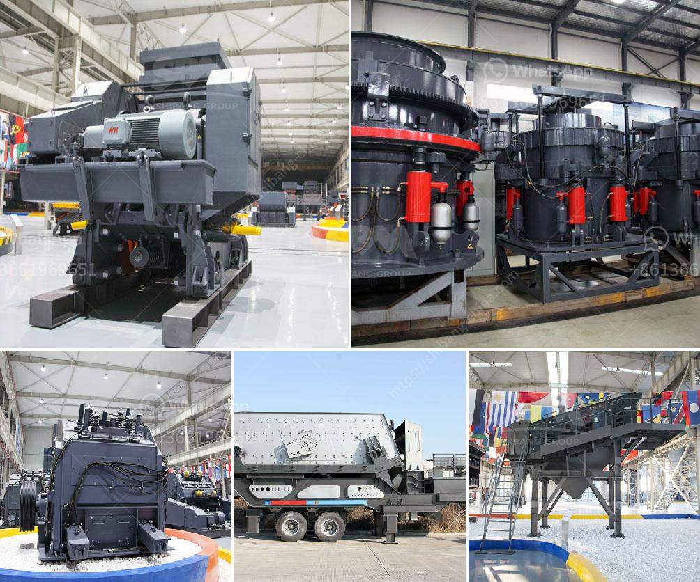

<h3>crushing plants for sale</h3>
Are you in the construction or mining industry looking for a reliable and efficient crushing plant for your operations? Buying a high-quality crushing plant can be a cost-effective investment for your business. But with so many options available, how do you ensure you are making the right choice? In this article, we will explore the benefits of crushing plants for sale and what factors to consider before making a purchase.

Firstly, let's understand what a crushing plant is. A crushing plant is a machine used to reduce the size of rocks and stones in aggregates production, mining operations and recycling applications. It is often categorized into different types based on the stages of crushing and the degree to which they break down materials. Common types of crushing plants include jaw crushers, cone crushers, impact crushers, and mobile crushers.

One of the key benefits of investing in a crushing plant is its ability to save time and money. By reducing the size of rocks and stones, crushing plants make it easier to handle and transport materials. This means that you can spend less time on manual labor and more time on other important aspects of your business. Additionally, the crushed materials can be reused in various construction projects, reducing the need for virgin materials and ultimately cutting down on costs.

Furthermore, modern crushing plants are equipped with advanced features that improve efficiency and productivity. For example, many crushers now come with adjustable settings, allowing you to customize the size of the output material. This flexibility ensures that you can meet the specific requirements of your project, whether you need fine aggregates for concrete production or larger stones for road construction.

When considering a crushing plant for sale, there are several factors to take into account. The first is the type of material you will be processing. Different plants are designed to handle different types of rocks and stones, so it's crucial to choose a machine that is suitable for your specific needs. Additionally, you should consider the production capacity of the plant, as this will determine how much material it can process in a given period.

Another important factor to consider is the maintenance and service requirements of the crushing plant. Like any other machine, regular maintenance is essential to ensure optimal performance and longevity. It's important to choose a plant that comes with reliable after-sales support and spare parts availability. This will save you from unexpected downtime and costly repairs in the future.

Lastly, it's crucial to assess the reputation and reliability of the manufacturer or supplier before making a purchase. Look for a company with a strong track record of delivering high-quality crushing plants. Reading customer reviews and testimonials can also provide you with valuable insights into the performance and durability of the machine.

In conclusion, investing in a crushing plant is a wise decision for any construction or mining business. With their ability to save time, reduce costs, and improve efficiency, crushing plants can significantly enhance your operations. Just make sure to consider the type of material, production capacity, maintenance requirements, and reputation of the manufacturer before making a final decision. With the right crushing plant, you can ensure a smooth and successful quarrying operation for years to come.
<h3>Contact us</h3><ul><li><strong>Whatsapp:&nbsp;<a href="https://wa.me/8613661969651">+8613661969651</a></strong></li><li><a href="https://swt.shibang-china.com/?git&amp;zhl&amp;crushing plants for sale"><strong>Online Service(chat now)</strong></a></li></ul><h3>Related</h3><ul><li><a href='machine grinds talcum powder.md'>machine grinds talcum powder</a></li><li><a href='cost or operating stone quarry and crusher.md'>cost or operating stone quarry and crusher</a></li><li><a href='hammer mill for ldpe grinding.md'>hammer mill for ldpe grinding</a></li><li><a href='steel hammer mill.md'>steel hammer mill</a></li><li><a href='quartz grinding machines.md'>quartz grinding machines</a></li></ul>