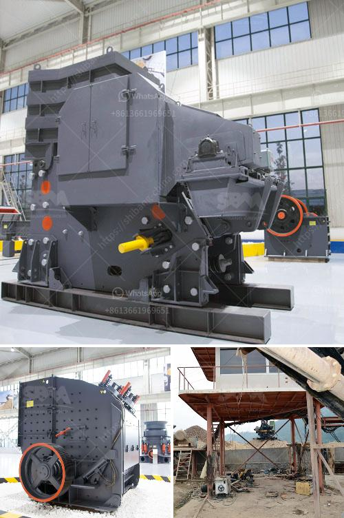

<h3>crushing plants in malaysia</h3>
Malaysia is one of the fastest growing economies in Southeast Asia, with a flourishing construction industry and burgeoning manufacturing sector. With relentless focus on infrastructure development and urbanization, the government has initiated numerous mega-projects within the country. The projects are expected to boost demand for machinery such as crushing plants, which are used to process raw materials extracted from the ground, for construction-related purposes.

Crushing plants are essential for the refinement of raw materials into final products. It is the stage where the ore is converted into desired sizes, depending on the intended use. The process can be purely mechanical, involving physical crushing, or it can be chemical, depending on the desired final product. Primary crushing is performed at the mine site, while secondary and tertiary crushing is done at the processing plant.

The company's expansion plans for the crushing plants in Malaysia include acquiring a quarry plant in order to increase production capacity. "We aim to produce more crushed stones to fulfill the high demand for infrastructure projects and housing development projects in Malaysia," said the company spokesperson.

The crushing plants in Malaysia are strategically located in locations where the raw materials are abundance, such as Sungai Batu, Jeram, Taman Sri Gombak, and Batu Caves. Crushing plants are primarily used for breaking down rocks into smaller stones, gravel, or sand. Due to the variety of rocks and minerals found in Malaysia, crushing plants can be used in a range of applications including mining, building materials, highway, railway, water conservancy, chemical industry, and many more.

The Malaysian government has recognized the potential of the crushing plants and has invested significantly in mega-infrastructure projects as part of its Economic Transformation Program. This includes the construction of highways, new airports, and the development of industrial zones. This has resulted in a surge in demand for construction materials, making crushing plants an integral part of Malaysia's growth story.

Crushing plants in Malaysia have a bright future, as Malaysia is emerging as one of Southeast Asia's largest consumers of mining equipment and machinery. The total market size for mining equipment in Southeast Asia is expected to reach USD 24.7 billion by 2025, driven by growing demand for mining machinery and infrastructure projects.

To cater to this increased demand, crusher plants are ideally located in areas that have ample access to rocks and mineral mines. This helps boost the production capacity of the crushing plants, making them the backbone of the construction and mining industries in Malaysia.

Moreover, the government is also investing in various infrastructure projects, such as the construction of the West Coast Expressway and the Central Spine Road, which will further increase the demand for crushing plants. These infrastructure projects are expected to provide a significant stimulus to the crushing plant market in Malaysia, leading to a surge in demand for crushing plants from both domestic and foreign investors.

In conclusion, the crushing plants in Malaysia are an integral part of Malaysia's growth story, fueled by the increasing demand for mining equipment, infrastructure projects, and the growth of the manufacturing sector. With abundant raw materials of multiple types and a growing infrastructure and construction industry, Malaysia is becoming an important market for crushing plants. Investment opportunities in this sector are expected to grow, making it a lucrative area for both local and international players.
<h3>Contact us</h3><ul><li><strong>Whatsapp:&nbsp;<a href="https://wa.me/8613661969651">+8613661969651</a></strong></li><li><a href="https://swt.shibang-china.com/?git&amp;zhl&amp;crushing plants in malaysia"><strong>Online Service(chat now)</strong></a></li></ul><h3>Related</h3><ul><li><a href='basalt production plant.md'>basalt production plant</a></li><li><a href='how much does it cost per day to run a gold mine.md'>how much does it cost per day to run a gold mine</a></li><li><a href='copper crusher for sale in malaysia.md'>copper crusher for sale in malaysia</a></li><li><a href='stone crusher machine in zimbabwe.md'>stone crusher machine in zimbabwe</a></li><li><a href='grinding unit cement plant south africa.md'>grinding unit cement plant south africa</a></li></ul>