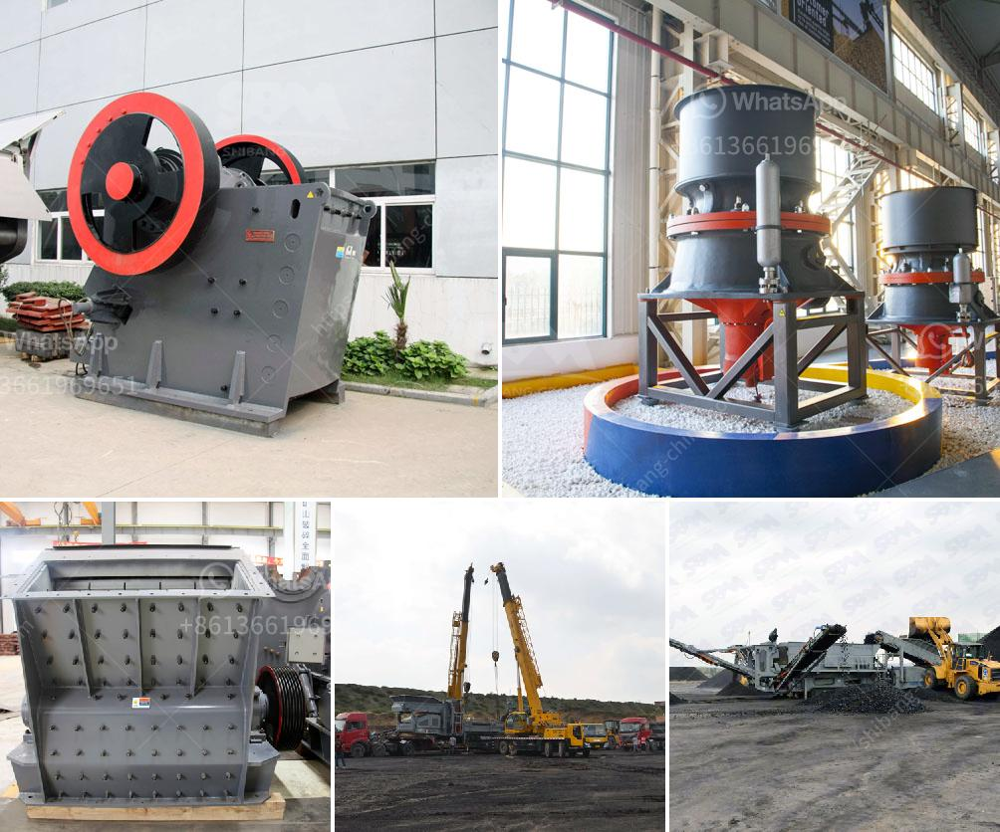

<h3>crushing plants pawer screen</h3>
Crushing plants are an essential part of the construction industry. They break down large rocks into smaller, more manageable pieces, allowing for easier transportation and further processing. One notable player in this field is Powerscreen, renowned for their efficient and reliable crushing plants. With their cutting-edge technology and sturdy construction, Powerscreen crushing plants have become increasingly popular in the industry.

One of the key features of Powerscreen crushing plants is their versatility. These plants can crush a wide range of materials, including limestone, granite, concrete, and asphalt. This flexibility allows contractors to process different types of rocks and minerals with ease, making it a valuable asset for various projects.

Another highlight of Powerscreen crushing plants is their power and efficiency. These plants are equipped with powerful engines that provide high levels of performance, making quick work of even the toughest materials. This helps in reducing overall operation costs and increasing productivity on job sites.

In addition to power, Powerscreen crushing plants also boast excellent mobility. They are designed to be easily transported from one location to another, allowing contractors to efficiently move and set up their crushing operation wherever it is needed. This mobility feature is particularly crucial for large-scale projects or sites with limited access, as it ensures the crushing plants can be quickly repositioned as necessary.

The reliability and durability of Powerscreen crushing plants cannot be overstated. They are constructed with high-quality materials and designed to withstand the rigors of heavy-duty use, both indoors and in harsh outdoor conditions. This ensures that the plants can withstand the demands of continuous operation without succumbing to wear and tear, resulting in minimal downtime and increased longevity.

Powerscreen crushing plants also focus on user-friendliness. They are equipped with intuitive control systems and easy-to-access maintenance points, streamlining operation and reducing the time and effort required for maintenance tasks. Thus, operators can spend more time on actual crushing work and less time on technicalities.

Environmentally conscious contractors will appreciate Powerscreen's commitment to sustainability. These crushing plants are designed to minimize environmental impact by reducing dust emissions and noise levels. This helps in maintaining a healthier work environment for operators and reducing the ecological footprint of the crushing operation.

In conclusion, Powerscreen crushing plants are an exceptional solution for contractors in need of efficient, reliable, and versatile crushing equipment. With their power, mobility, and durability, these plants excel in breaking down various materials with ease. Furthermore, their user-friendly features and commitment to sustainability make them a top choice in the industry. Whether for large-scale construction projects or smaller jobs, Powerscreen crushing plants prove to be a valuable asset, allowing contractors to crush rocks and minerals quickly and effectively.
<h3>Contact us</h3><ul><li><strong>Whatsapp:&nbsp;<a href="https://wa.me/8613661969651">+8613661969651</a></strong></li><li><a href="https://swt.shibang-china.com/?git&amp;zhl&amp;crushing plants pawer screen"><strong>Online Service(chat now)</strong></a></li></ul><h3>Related</h3><ul><li><a href='crusher plant price.md'>crusher plant price</a></li><li><a href='crusher machine nigeria.md'>crusher machine nigeria</a></li><li><a href='roller mill for onions.md'>roller mill for onions</a></li><li><a href='china cement grinding unit manufacturers.md'>china cement grinding unit manufacturers</a></li><li><a href='cone crusher sri lanka for sale.md'>cone crusher sri lanka for sale</a></li></ul>