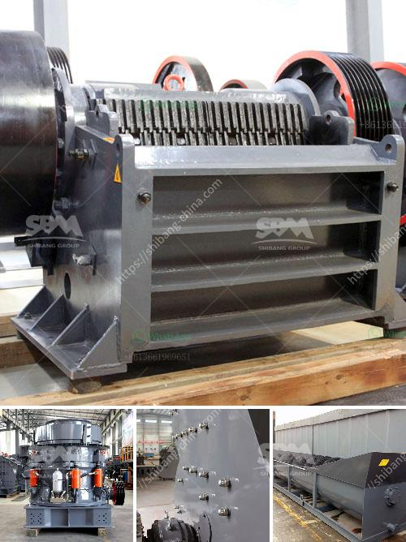

<h3>crushing sale rotary drum dryer cost</h3>
In today's competitive business environment, cost reduction has become a primary concern for many industries. One area where significant savings can be achieved is in the operation of rotary drum dryers. These powerful machines are widely used in various industries to dry a wide range of materials, including minerals, aggregates, chemicals, and more. With the right approach, one can effectively crush the sale prices of rotary drum dryers, resulting in substantial cost savings for businesses.

The first step to reducing the cost of rotary drum dryers is to carefully analyze the specific drying needs of your business. By understanding the requirements of your materials and the desired moisture content, you can better assess the capacity and features required for your drum dryer. This knowledge allows you to avoid over-specifying the equipment, which can result in unnecessary expenses.

Next, it is crucial to conduct thorough research on the market. There are various manufacturers and suppliers offering rotary drum dryers, each with different price points. Identifying reputable companies that provide high-quality equipment at competitive prices is crucial.

When negotiating with suppliers, it is essential to be well-informed about your specific needs. Sharing your requirements, volume expectations, and desired price range can help the supplier propose suitable alternatives and deals. Leverage your knowledge of the market and competition to gain a stronger position in negotiations.

Additionally, consider collaborating with other businesses in similar industries to leverage collective purchasing power. Jointly sourcing rotary drum dryers and other equipment can lead to significant price reductions, as suppliers are more likely to offer discounted rates for bulk orders.

Upon selecting a supplier, explore the potential for customization. While off-the-shelf rotary drum dryers may initially seem cost-effective, they may not fully meet your specific needs. Customization can lead to improved efficiency, reduced energy consumption, and overall cost savings over the long term. Work with the supplier to identify modifications or additional features that align with your requirements without significantly inflating the price.

Investing in the latest technological advancements can also contribute to cost reduction. Rotary drum dryers equipped with advanced control systems, efficiency enhancements, and energy-saving technologies can yield substantial savings in operational expenses. Though these models may initially have a higher price tag, their long-term benefits can outweigh the upfront costs.

Proper maintenance and operational protocols are crucial for preserving the lifespan and efficiency of your rotary drum dryer. Implementing regular maintenance schedules, adhering to operating guidelines, and training staff can prevent unnecessary breakdowns, expensive repairs, and decreased productivity. By extending the lifespan of your dryer, you avoid costly premature replacements.

Lastly, consider the potential for leasing or renting rotary drum dryers. This option can minimize initial capital investment while providing access to high-quality equipment. Evaluate the costs associated with leasing versus purchasing to determine the most cost-effective solution for your business.

In conclusion, the cost of rotary drum dryers can be crushed by following a strategic approach. Understand your specific drying needs, conduct thorough market research, negotiate effectively, consider collaborations, explore customization options, invest in technological advancements, implement proper maintenance procedures, and evaluate lease options. By implementing these tactics, businesses can successfully reduce costs and enhance their overall competitiveness.
<h3>Contact us</h3><ul><li><strong>Whatsapp:&nbsp;<a href="https://wa.me/8613661969651">+8613661969651</a></strong></li><li><a href="https://swt.shibang-china.com/?git&amp;zhl&amp;crushing sale rotary drum dryer cost"><strong>Online Service(chat now)</strong></a></li></ul><h3>Related</h3><ul><li><a href='small scale industrial pulveriser.md'>small scale industrial pulveriser</a></li><li><a href='ball milling method.md'>ball milling method</a></li><li><a href='barite mill in india.md'>barite mill in india</a></li><li><a href='stone pulverizer machine.md'>stone pulverizer machine</a></li><li><a href='machine that to crush rock.md'>machine that to crush rock</a></li></ul>