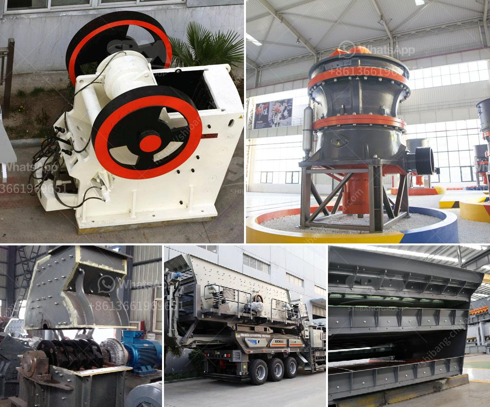

<h3>crushing stone machines for sale in usa</h3>
Crushing stone machines are used to crush hard and abrasiveness stones as well as other materials like ores and minerals. In the construction industry, these machines are widely used to crush large stones into smaller pieces in order to meet specific requirements for construction projects. With the increasing demand for crushed stones in the USA, the sales of crushing stone machines have witnessed significant growth.

In the USA, there are various types of crushing stone machines available for sale. The machines differ in their capabilities and features, allowing customers to choose the most suitable one for their specific needs. Jaw crushers, impact crushers, cone crushers, and gyratory crushers are some of the commonly used machines in crushing stones.

Jaw crushers, also known as primary crushers, are used for coarse crushing. These machines have a stationary jaw and a movable jaw, with the material being crushed between them. Impact crushers, on the other hand, use impact force to crush stones. They have a high-speed rotor that throws the stones against the crushing chamber walls, resulting in the desired crushed product size.

Cone crushers are often used for intermediate crushing. They have a cone-shaped crushing chamber, where the rocks are squeezed between the mantle and concave. Gyratory crushers, similar to cone crushers, also have a conical crushing chamber but operate with a gyrating motion instead.

Crushing stone machines for sale in the USA can be found in various capacities, ranging from 10 to 500 tons per hour. The machines are also available in different power requirements to suit the specific needs of customers. Whether it is for small-scale construction projects or large-scale infrastructure development, there are crushing stone machines available to meet every requirement.

In conclusion, with the increasing demand for crushed stones in the USA, the sale of crushing stone machines has witnessed significant growth. These machines play a vital role in the construction industry, allowing stones to be crushed into smaller pieces for use in various applications. With a wide range of machines available for sale, customers can choose the most suitable one to meet their specific needs and requirements. Whether for small or large-scale projects, there are crushing stone machines available to facilitate efficient and productive stone crushing operations.
<h3>Contact us</h3><ul><li><strong>Whatsapp:&nbsp;<a href="https://wa.me/8613661969651">+8613661969651</a></strong></li><li><a href="https://swt.shibang-china.com/?git&amp;zhl&amp;crushing stone machines for sale in usa"><strong>Online Service(chat now)</strong></a></li></ul><h3>Related</h3><ul><li><a href='cost of a stone crusher.md'>cost of a stone crusher</a></li><li><a href='machine for crushing stones.md'>machine for crushing stones</a></li><li><a href='crushing and screening distributing in philippines.md'>crushing and screening distributing in philippines</a></li><li><a href='sag mill grinding ball.md'>sag mill grinding ball</a></li><li><a href='list of quarrying companies in the philippines.md'>list of quarrying companies in the philippines</a></li></ul>