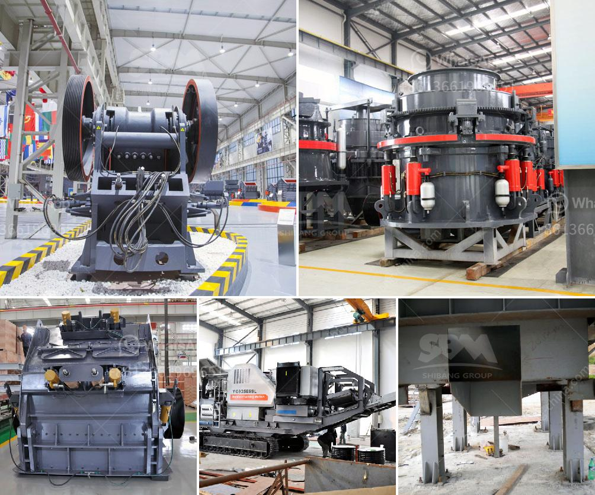

<h3>cs cone crusher</h3>
The cone crusher is a machine used in the construction industry for crushing different varieties of rocks and ores of varying hardness. Cone crushers have a stable structure, an efficient and simple adjustment, and are used extensively. The crusher functions by pushing on substances held between the fixed cone and the movable cone. The cone crusher splits the rocks by clutching them between an eccentric rotating spindle that is enclosed by a tough layer, and a concave hopper. As the rocks enter the crusher, they are wedged between the layer and the concave hopper. Big pieces are broken, and then these are dropped to another position, where the breaking process occurs again. This technological advancement allows crushers to be constantly reinvented and allows operators to have significantly more selection when it comes to machine selection.

The cs cone crusher is widely applied in industries such as metallurgy, construction, road building, chemical and phosphate industry. The cone crusher is suitable for crushing hard and medium-hard rocks and ores, such as iron ore, limestone, copper ore, quartz, granite, and sandstone.

Another notable feature of the cs cone crusher is its ability to transform different materials into desired end products. This is achieved by adjusting the crusher's cone stroke, setting, and speed. By changing these parameters, the particle size distribution can be controlled, making it possible to produce crushed stones of various sizes.

The cs cone crusher has high efficiency and low energy consumption in the production process, and can be used for the crushing of medium and high hardness materials. It enjoys a wide range of applications and is popular worldwide.

In conclusion, the cs cone crusher is a valuable investment for any construction company, offering unmatched performance and versatility. With its ability to crush rocks of diverse hardnesses and produce various end products, it proves to be a reliable and efficient machine for any crushing operation.
<h3>Contact us</h3><ul><li><strong>Whatsapp:&nbsp;<a href="https://wa.me/8613661969651">+8613661969651</a></strong></li><li><a href="https://swt.shibang-china.com/?git&amp;zhl&amp;cs cone crusher"><strong>Online Service(chat now)</strong></a></li></ul><h3>Related</h3><ul><li><a href='jaw crusher size specifications.md'>jaw crusher size specifications</a></li><li><a href='manganese washing equipment cost.md'>manganese washing equipment cost</a></li><li><a href='quarry equipment for hire in nigeria.md'>quarry equipment for hire in nigeria</a></li><li><a href='aggregate crusher machine suppliers.md'>aggregate crusher machine suppliers</a></li><li><a href='ultra fine milling machines.md'>ultra fine milling machines</a></li></ul>