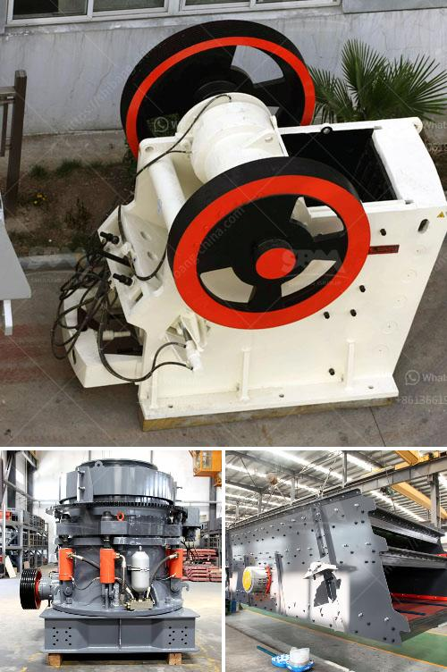

<h3>cs series cone crusher agents in south africa</h3>
The CS series cone crusher is a high-performance machine that has been specifically designed for crushing rocks and minerals. This machine is commonly used in the mining and construction industries, where it is utilized to break down large rocks into smaller particles for further processing.

South Africa is known for its extensive mining industry, which has played a crucial role in the country's economic development for well over a century. Despite the challenges faced by the mining industry, it continues to be a significant contributor to the country's gross domestic product (GDP).

Given the importance of the mining industry in South Africa, there is a high demand for efficient and reliable crushing equipment. This is where the CS series cone crusher comes into play. With its advanced technology and robust construction, this machine has gained popularity among mining operators in the country.

One of the key factors contributing to the success of the CS series cone crusher in South Africa is the availability of a strong network of agents. These agents play a crucial role in promoting the machine and providing technical support to customers. By having agents strategically located throughout the country, customers can easily access the equipment and obtain the necessary assistance when required.

The agents act as a bridge between the manufacturer and the end-users. They have in-depth knowledge about the CS series cone crusher and can provide valuable information and guidance to customers. This includes educating customers about the features and benefits of the machine, its applications, and maintenance requirements.

In addition, the agents also assist with the installation, commissioning, and after-sales service of the CS series cone crusher. They ensure that the machine is correctly set up and running optimally, allowing customers to achieve maximum productivity and minimize downtime. This level of support is crucial for mining operators, as any interruption in production can result in significant financial losses.

Furthermore, the agents also stock a wide range of spare parts for the CS series cone crusher, ensuring that customers have quick access to replacements when needed. This not only minimizes downtime but also prolongs the lifespan of the machine and reduces maintenance costs in the long run.

Overall, the presence of agents for the CS series cone crusher in South Africa has been instrumental in its success in the market. Their expertise, technical support, and availability of spare parts have made it easier for mining operators to adopt this machine and achieve higher productivity. As the mining industry in South Africa continues to evolve, the CS series cone crusher, along with its dedicated network of agents, will undoubtedly continue to play a crucial role in meeting the growing demand for crushing equipment.
<h3>Contact us</h3><ul><li><strong>Whatsapp:&nbsp;<a href="https://wa.me/8613661969651">+8613661969651</a></strong></li><li><a href="https://swt.shibang-china.com/?git&amp;zhl&amp;cs series cone crusher agents in south africa"><strong>Online Service(chat now)</strong></a></li></ul><h3>Related</h3><ul><li><a href='portable mobile crusher for sale.md'>portable mobile crusher for sale</a></li><li><a href='sand washing plant for sale in uae.md'>sand washing plant for sale in uae</a></li><li><a href='quartz grinding machines.md'>quartz grinding machines</a></li><li><a href='used clay powder drying machinery.md'>used clay powder drying machinery</a></li><li><a href='barite mining crusher process.md'>barite mining crusher process</a></li></ul>