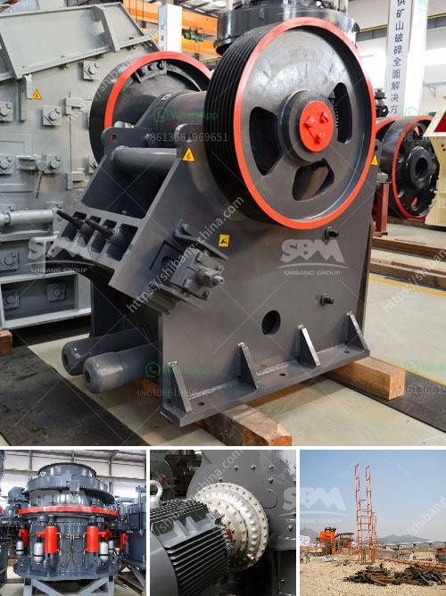

<h3>dealer stone crusher di indonesiain indonesia</h3>
Dealer stone crusher di Indonesia is a combination of machines that can crush and process various types of stones such as pebbles, granite, limestone, iron ore, gravel, etc. It will be used for different construction and road projects in Indonesia.

As a professional dealer of crusher machines, I have been providing the best machines for people in Indonesia for many years. With our experience and expertise, we have helped countless customers choose the right machines based on their specific requirements.

The stone crusher machines offered by dealers in Indonesia have a wide range of functions. For instance, jaw crushers are primarily used for crushing large rocks into smaller rocks or gravel. These machines come in various sizes and types, and their output capacities can vary from as low as 30 tons per hour to as high as 500 tons per hour.

In addition to jaw crushers, there are also cone crushers that operate similarly but have the ability to crush harder stones such as granite and basalt. These machines are ideal for projects that require a higher crushing capacity and finer product sizes. You can also find impact crushers that are ideal for crushing stones with a high silica content or those with a more abrasive nature.

Aside from these primary crushers, there are also secondary and tertiary crushers available. Secondary crushers are used after primary crushers and are used to produce a finer material for further processing. Tertiary crushers, on the other hand, are used to produce even finer materials and can be used in conjunction with primary and secondary crushers for maximum efficiency.

When choosing a dealer for stone crusher machines, it is important to consider factors such as reputation, after-sales service, and quality of machines. Reputable dealers will have a proven track record of providing reliable and durable machines that are built to withstand tough working conditions. They will also have a well-established after-sales service network to provide prompt support and maintenance whenever necessary.

Additionally, you should also consider the availability of spare parts for the machines. It is much more convenient to choose a dealer who can provide a steady supply of genuine spare parts whenever needed. This ensures that your machines will have a longer lifespan and minimal downtime due to repairs.

In conclusion, finding a reliable dealer for stone crusher machines in Indonesia is crucial for ensuring the success of your construction and road projects. Choose a dealer who offers a wide range of machines to suit your specific needs, and make sure they have a good reputation and excellent after-sales service. By investing in high-quality machines from a reputable distributor, you can maximize your productivity and achieve better results.
<h3>Contact us</h3><ul><li><strong>Whatsapp:&nbsp;<a href="https://wa.me/8613661969651">+8613661969651</a></strong></li><li><a href="https://swt.shibang-china.com/?git&amp;zhl&amp;dealer stone crusher di indonesiain indonesia"><strong>Online Service(chat now)</strong></a></li></ul><h3>Related</h3><ul><li><a href='used rotary kiln equipment for sale.md'>used rotary kiln equipment for sale</a></li><li><a href='mining equipment for hire zimbabwe.md'>mining equipment for hire zimbabwe</a></li><li><a href='crusher on rent in india.md'>crusher on rent in india</a></li><li><a href='high efficiency separator for raw material ball mill.md'>high efficiency separator for raw material ball mill</a></li><li><a href='chrome processing and drying.md'>chrome processing and drying</a></li></ul>