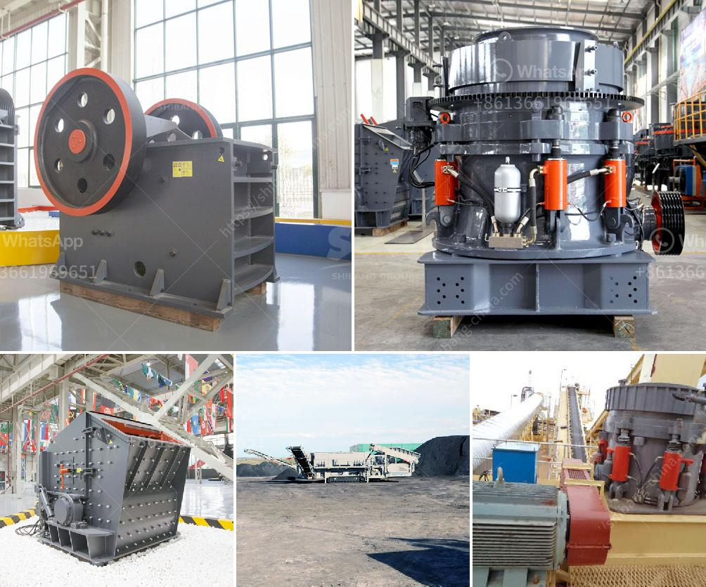

<h3>dealers of mobile jaw crusher in kenya</h3>
Mobile jaw crushers are gaining popularity due to their ability to process a wide variety of materials, such as demolition waste, concrete, asphalt, and natural stone. This development is driven by the increasing demand for mobile crushers that allow operators to maximize their potential in quarries, mines, or construction sites.

In Kenya, there are a number of mobile jaw crusher dealers. These dealers provide the customers with a variety of options when it comes to choosing the right crusher for their needs. Since the crushers are heavy-duty machinery that consumes substantial amounts of power and requires routine maintenance, dealers ensure they offer machines that are durable, efficient, and easy to maintain.

One of the leading mobile jaw crusher dealers in Kenya is Mwafrika Ballast Crushers. In partnership with Metso, this dealer offers fixed and mobile jaw crushers for purchase and rental. They also have a team of skilled personnel who provide repair, maintenance, and installation services at the client's location or at their workshop.

The mobile jaw crushers provided by Mwafrika Ballast Crushers are commonly used in the rock quarrying and mining industries. These machines are designed to process rocks into smaller sizes for further crushing or as aggregate for road construction and other civil works. With a mobile jaw crusher, operators can greatly reduce the transportation costs associated with hauling rocks from quarries to the processing plants.

Another popular dealer in Kenya is Forrec Ltd. This dealer specializes in providing mobile jaw crushers for various applications, including recycling, demolition waste management, and road construction. Forrec Ltd offers a range of jaw crushers with different specifications to meet the diverse needs of their customers. Their machines are known for their high performance, reliability, and versatility.

Kenya is also home to Prodev Engineering Ltd, a leading dealer of mobile jaw crushers that cater to the construction and mining industries. Prodev Engineering offers a complete range of mobile jaw crushers, including traditional toggle-style crushers and newer hydraulic models. Their machines are known for their precision engineering, robust design, and low maintenance requirements.

In conclusion, there are several reputable dealers of mobile jaw crushers in Kenya. These dealers offer a range of machines that are designed to process various materials and cater to different industries. Whether it is for quarrying, mining, recycling, or construction, customers in Kenya can find the right mobile jaw crusher for their needs. Additionally, these dealers provide repair, maintenance, and installation services to ensure the machines operate optimally throughout their lifespan. With the availability of these dealers, operators can confidently invest in mobile jaw crushers to boost productivity, reduce costs, and efficiently process materials.
<h3>Contact us</h3><ul><li><strong>Whatsapp:&nbsp;<a href="https://wa.me/8613661969651">+8613661969651</a></strong></li><li><a href="https://swt.shibang-china.com/?git&amp;zhl&amp;dealers of mobile jaw crusher in kenya"><strong>Online Service(chat now)</strong></a></li></ul><h3>Related</h3><ul><li><a href='price of conveyor belts for mining.md'>price of conveyor belts for mining</a></li><li><a href='marble quarry equipment.md'>marble quarry equipment</a></li><li><a href='mobile mineral processing gravity plants.md'>mobile mineral processing gravity plants</a></li><li><a href='vrm cement grinding.md'>vrm cement grinding</a></li><li><a href='cement mill startup procedures.md'>cement mill startup procedures</a></li></ul>