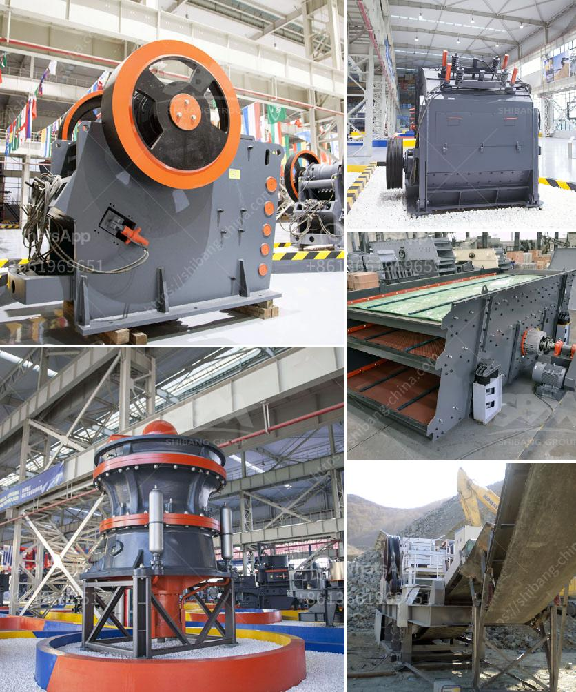

<h3>demolition plants crushers in lima</h3>
In the bustling city of Lima, Peru, where rapid urbanization and development are constantly reshaping the landscape, the role of demolition plants and crushers has become increasingly vital. Lima, a city known for its rich history and impressive architecture, is now facing the challenge of renovations and the removal of old structures to make way for modern designs. Demolition plants and crushers have emerged as the unsung heroes of this transformation, revolutionizing the construction industry in Lima.

These high-powered machines, designed specifically for the purpose of breaking down large concrete structures, have transformed the way demolition projects are approached. The sheer power and efficiency of these crushers have made once labor-intensive and time-consuming processes quick, precise, and cost-effective. Lima’s skyline is now dotted with these demolition plants, which have truly become a driving force behind the city’s continuous urban development.

One of the key benefits of using crushers in demolition projects is the reduction in waste and environmental impact. By pulverizing large concrete chunks into smaller manageable sizes, the crusher allows for the recycling and reuse of materials, minimizing the need for new construction materials. This not only reduces landfill waste but also contributes to sustainable construction practices, aligning Lima with global efforts to reduce carbon footprints and promote eco-friendly solutions.

Furthermore, the crushers offer an unparalleled level of safety for both workers and bystanders. With their advanced technology and precision, they can target specific areas for demolition, drastically reducing the risk of accidents and collateral damage. Lima's congested streets and narrow work areas have made safety a top priority, and the use of these state-of-the-art machines has significantly improved overall job site safety.

Additionally, the speed and efficiency of these demolition plants have transformed project timelines in Lima. The use of traditional methods for breaking down concrete would often result in delays, but the crushers have dramatically reduced the time required to complete demolition tasks. This has allowed construction projects in Lima to proceed at a faster pace, leading to increased productivity and economic growth in the region.

Furthermore, the introduction of demolition plants and crushers has created job opportunities in Lima. With the rise in demand for these machines, local businesses have started manufacturing and servicing crushers, creating employment opportunities for skilled workers. This not only boosts the local economy but also supports the development of a thriving construction industry in Lima.

To facilitate the growth of this industry, it is crucial for construction companies and authorities in Lima to invest in the latest demolition plant technologies and ensure the proper training of operators. By doing so, they can maximize the benefits of these machines, ensuring safer and more sustainable construction practices, reducing project costs, and speeding up the urban development process.

In conclusion, the advent of demolition plants and crushers in Lima has revolutionized the construction industry, transforming the city's skyline and paving the way for sustainable urban development. These powerful machines have reduced waste, improved safety, accelerated project timelines, and created job opportunities. As Lima continues to grow and evolve, the utilization of these crushers will remain an essential tool in shaping the future of the city.
<h3>Contact us</h3><ul><li><strong>Whatsapp:&nbsp;<a href="https://wa.me/8613661969651">+8613661969651</a></strong></li><li><a href="https://swt.shibang-china.com/?git&amp;zhl&amp;demolition plants crushers in lima"><strong>Online Service(chat now)</strong></a></li></ul><h3>Related</h3><ul><li><a href='complete stone quarry plant.md'>complete stone quarry plant</a></li><li><a href='business proposal for stone quarry project.md'>business proposal for stone quarry project</a></li><li><a href='cement plant cost estimation.md'>cement plant cost estimation</a></li><li><a href='kolberg pioneer ft4240 impact crusher.md'>kolberg pioneer ft4240 impact crusher</a></li><li><a href='stone crusher price.md'>stone crusher price</a></li></ul>