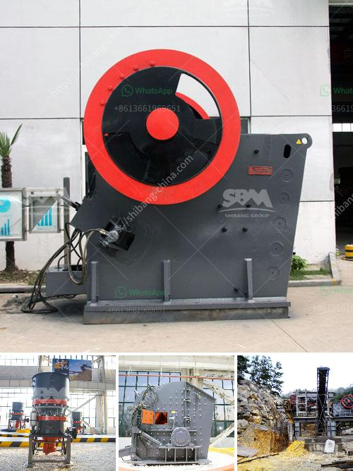

<h3>dense medium separation equipment supplier</h3>
Dense medium separation (DMS) is a widely used process in the mining and mineral processing industries, designed to separate valuable materials from waste by utilizing the difference in specific gravity. A vital component in DMS operations is the dense medium separation equipment, which enables efficient and accurate separation. Choosing a reliable supplier for such equipment is vital for ensuring optimal performance, cost-effectiveness, and long-term success of DMS applications. In this article, we will explore the key factors to consider when selecting a dense medium separation equipment supplier.

When evaluating potential suppliers, it is crucial to consider their expertise and reputation in the dense medium separation field. A reputable supplier will have a track record of delivering high-quality equipment, backed by extensive industry knowledge. Look for suppliers that have been in the market for a significant period, as they would have accumulated valuable experience and expertise in designing and manufacturing efficient dense medium separation equipment.

Every mining operation is unique, with varying ore types, sizes, and specific requirements. Therefore, choosing a supplier that offers customizable dense medium separation equipment is essential. An adaptable supplier will work closely with the customer to understand their unique needs and devise tailored solutions that maximize the efficiency and effectiveness of the separation process. Customization can involve modifications to equipment dimensions, feed rates, and media fluid characteristics, ensuring optimal performance and productivity.

The durability and reliability of the equipment are critical factors to consider. The chosen supplier should adhere to stringent quality standards and employ robust manufacturing practices. Equipment must be constructed using high-quality materials and undergo rigorous testing to ensure its performance and long service life. Quality manufacturing processes significantly reduce downtime, maintenance costs, and potential operational risks. Therefore, it is crucial to select a supplier who invests in maintaining the highest quality standards and provides warranties or guarantees to assure customers of reliable performance.

Excellent customer support is crucial when selecting a dense medium separation equipment supplier. The supplier should provide technical expertise, assistance during installation and commissioning, and ongoing support to optimize the equipment's performance. Additionally, ensure the supplier offers readily available spare parts and components, minimizing downtime in case of unexpected breakdowns. Prompt and reliable after-sales service is vital for the uninterrupted functioning of the DMS process, ensuring uninterrupted operations and maximizing productivity.

Choosing a reliable dense medium separation equipment supplier is vital for successful DMS operations in the mining and mineral processing industries. By considering factors such as expertise and reputation, customization, equipment quality and reliability, as well as customer support and after-sales service, companies can select a supplier that will meet their unique requirements effectively. Investing time and effort into selecting the right supplier will result in less downtime, improved operational efficiency, and ultimately, increased profitability for mining operations that rely on dense medium separation techniques.
<h3>Contact us</h3><ul><li><strong>Whatsapp:&nbsp;<a href="https://wa.me/8613661969651">+8613661969651</a></strong></li><li><a href="https://swt.shibang-china.com/?git&amp;zhl&amp;dense medium separation equipment supplier"><strong>Online Service(chat now)</strong></a></li></ul><h3>Related</h3><ul><li><a href='conveyor belt seller in korea.md'>conveyor belt seller in korea</a></li><li><a href='stone crushing plant use jaw crusher price list.md'>stone crushing plant use jaw crusher price list</a></li><li><a href='small scale crushing plant.md'>small scale crushing plant</a></li><li><a href='gypsum board thailand manufacturer.md'>gypsum board thailand manufacturer</a></li><li><a href='ball mill capacity of tons.md'>ball mill capacity of tons</a></li></ul>