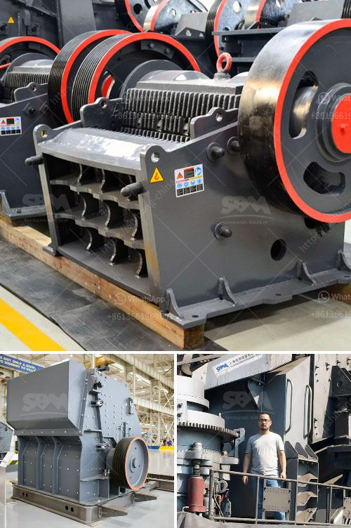

<h3>density of balls for mills</h3>
In the realm of milling, the selection and management of balls are critical for achieving optimal results. The density of balls used in mills plays a significant role in determining the efficiency and success of the milling process. With an increasing number of industries relying on mills for various applications, understanding the importance of ball density becomes indispensable.

The density of balls refers to the mass of the balls per unit volume. It directly affects the grinding efficiency, wear rate, and overall performance of the mill. For instance, a higher ball density offers increased impact force during the milling process, enhancing the grinding efficiency and reducing the required time for size reduction. On the other hand, a lower ball density may result in poor grinding efficiency, longer processing time, and higher energy consumption.

The choice of ball density depends on several factors, including the type of mill, material being processed, desired particle size, and the specific requirements of the application. In general, mills with higher ball density are suitable for fine grinding applications where the particle size reduction needs to be more precise. On the contrary, mills with lower ball density are often suitable for coarse grinding, where faster processing and higher throughput are required.

The range of ball density for mills typically falls between 2.5 g/cm³ to 7.9 g/cm³. The optimum ball density depends on the specific circumstances and should be determined through experimental trials. It is important to note that exceeding the recommended ball density can lead to excessive wear of the mill and its components, resulting in increased maintenance and downtime.

To ensure an appropriate ball density for mills, manufacturers and operators need to consider various factors. These include the ball-to-powder weight ratio, the distribution of ball sizes, filling degree, and rotational speed. Additionally, regular monitoring and adjustment of the ball density during the milling process can help maintain optimal conditions and improve overall productivity.

In summary, the density of balls used in mills plays a crucial role in the efficiency and success of milling operations. Proper selection and management of ball density can result in enhanced grinding efficiency, reduced processing time, and improved overall performance. By considering the specific requirements and conducting regular monitoring, manufacturers and operators can optimize ball density and achieve better results in various milling applications.
<h3>Contact us</h3><ul><li><strong>Whatsapp:&nbsp;<a href="https://wa.me/8613661969651">+8613661969651</a></strong></li><li><a href="https://swt.shibang-china.com/?git&amp;zhl&amp;density of balls for mills"><strong>Online Service(chat now)</strong></a></li></ul><h3>Related</h3><ul><li><a href='price kenya crushers.md'>price kenya crushers</a></li><li><a href='crusher plant price.md'>crusher plant price</a></li><li><a href='mining equipment for hire zimbabwe.md'>mining equipment for hire zimbabwe</a></li><li><a href='powder mill grinding machine in nigeria.md'>powder mill grinding machine in nigeria</a></li><li><a href='gold stamp mills in zimbabwe.md'>gold stamp mills in zimbabwe</a></li></ul>