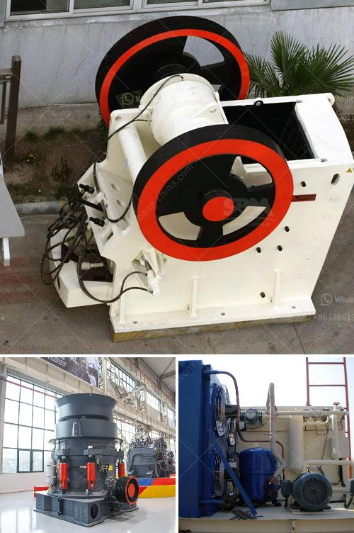

<h3>deodorization clay processing price</h3>
Deodorization clays are a crucial component used in various industries, including cosmetics, food processing, and environmental management. They help in the removal of unwanted odors and impurities from various materials, making them an essential tool for many businesses. But have you ever wondered about the factors that influence the price of deodorization clay processing? In this article, we will delve into the key elements that contribute to the pricing of this vital resource.

1. Quality and Purity: One of the primary determinants of deodorization clay processing prices is its quality and purity. Clays with higher purity levels are more effective in odor absorption and tend to be more expensive. The cost of mining and processing to obtain purer clay also drives up the price. Manufacturers often invest in advanced techniques to ensure a higher purity level, resulting in a higher price tag for the end product.

2. Processing Techniques: The method employed for processing the clay also plays a crucial role in determining its price. Different processing techniques, such as air drying, sun drying, or kiln drying, impact the overall cost. Additionally, the inclusion of additional steps, such as grinding or micronization, further increases the price as it enhances the clay's performance. Special processing techniques, like activating the clay with certain chemicals, can also drive up costs due to the investment in equipment and expertise required.

3. Supply and Demand: Just like any other commodity, the price of deodorization clay is significantly influenced by supply and demand dynamics. If there is a high demand for the product and limited supply, the price tends to rise. Conversely, if there is an oversupply of clay in the market, prices may decrease. Environmental factors, market trends, and fluctuations in raw material availability can all contribute to the supply and demand dynamics of deodorization clay, impacting its price.

4. Packaging and Logistics: The cost of packaging and logistics is another factor that affects the final price of deodorization clay. Packaging materials, such as bags or containers, need to be durable and easy to handle to ensure the clay's safe transportation. Additionally, the distance between the production facility and end-users affects the transportation cost. Longer distances often result in higher transportation expenses and can impact the final price of the clay.

5. Research and Development: Companies invested in research and development to improve the performance and quality of deodorization clays often charge a premium for their products. Extra expenses incurred in formulating innovative clay compositions or introducing new manufacturing techniques are factored into the price. These enhanced products usually have better absorption capabilities, making them more desirable for certain industries, such as cosmetics or food processing.

In conclusion, the price of deodorization clay processing is determined by various factors, including quality and purity, processing techniques, supply and demand dynamics, packaging and logistics, and research and development efforts. Understanding these factors can help buyers and users of deodorization clays make informed decisions about their purchases while also enabling them to appreciate the value and investment that goes into producing these essential materials.
<h3>Contact us</h3><ul><li><strong>Whatsapp:&nbsp;<a href="https://wa.me/8613661969651">+8613661969651</a></strong></li><li><a href="https://swt.shibang-china.com/?git&amp;zhl&amp;deodorization clay processing price"><strong>Online Service(chat now)</strong></a></li></ul><h3>Related</h3><ul><li><a href='professional granite cone crusher.md'>professional granite cone crusher</a></li><li><a href='bauxite crusher manufacturer in china mill gold.md'>bauxite crusher manufacturer in china mill gold</a></li><li><a href='hammer mills for sale at saro zambia.md'>hammer mills for sale at saro zambia</a></li><li><a href='100tpd complete gold plant.md'>100tpd complete gold plant</a></li><li><a href='lime making machine.md'>lime making machine</a></li></ul>