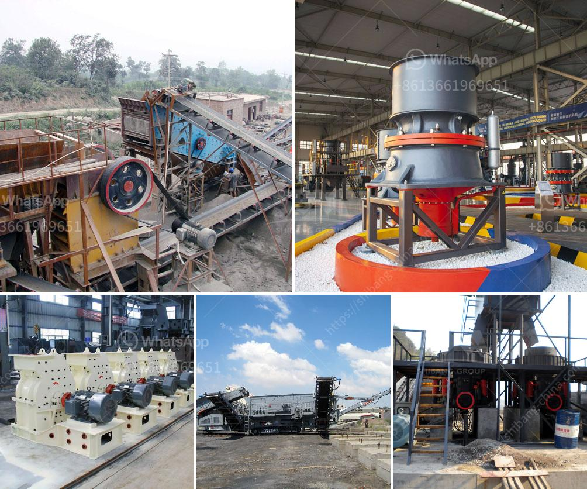

<h3>design calculation in jaw crusher</h3>
Jaw crushers are used to break-up hard materials, such as rock and concrete. This is done by a reciprocating movement of the swinging jaw, which compresses and crushes the material against the fixed jaw. Jaw crushers are popular due to their simple design and easy maintenance. These machines are designed to be rugged and durable.

In order to design the jaw crusher, a theoretical analysis is conducted to determine the dimensions of the crusher. The parameters such as the minimum and maximum feed size, the maximum lump size, the capacity in terms of tonnage per hour, and the feed rate are determined. These parameters will be used to develop the geometry of the crusher.

The geometry of the crusher includes the angle of nip (the angle between the jaws at the feed opening), the crusher throw (the distance that the swing jaw travels), and the closed-side setting (the minimum distance between the jaws during the crushing process). These parameters determine the size and shape of the crushed material.

The first step in the calculation of jaw crusher design parameters is to obtain the feed rate. This is calculated by dividing the amount of feed per period (D) by the length of the cycle (T). The cycle length is the interval between the opening and closing of the jaws. In a single-toggle jaw crusher, the throw is determined by the eccentric shaft, which is driven by the flywheel to move the swing jaw against the fixed jaw. The throw of the crusher is the distance that moving jaw moves in going from OSS to CSS. Throw = OSS-CSS.

With the parameter of feed rate, it is possible to estimate the power consumption for crushing materials. The power required for a jaw crusher would be given by the equation:

P = 0.01195WkN1.5, where P is the power, W is the work done per cycle, k is the work index, and N is the cycle rate.

To determine the capacity of jaw crushers, the final size of the crushed product must be computed. Using the capacity equation, the throughput rate will be multiplied by the factor depending on the material being crushed and the discharge setting (CSS) of the jaw crusher. The CSS is the smallest distance between the concave and the mantle of the crusher at the bottom of the crusher cavity.

Once the capacity is determined, the final step is to determine the dimensions of the crusher. The dimensions include the width of the jaw plates, the gap or set, and the sharpness of the crushing angle. These dimensions are crucial to ensure that the crushing process is efficient.

In conclusion, the design calculation of jaw crusher requires rigorous calculations and consideration of several factors. The geometry of the crusher will determine the shape and size of the crushed material. The throw and closed-side setting will determine the capacity and power consumption of the crusher. By carefully considering these factors, a well-designed jaw crusher can provide high productivity and long service life.
<h3>Contact us</h3><ul><li><strong>Whatsapp:&nbsp;<a href="https://wa.me/8613661969651">+8613661969651</a></strong></li><li><a href="https://swt.shibang-china.com/?git&amp;zhl&amp;design calculation in jaw crusher"><strong>Online Service(chat now)</strong></a></li></ul><h3>Related</h3><ul><li><a href='cement mill motor for sale uk.md'>cement mill motor for sale uk</a></li><li><a href='chrome processing and drying.md'>chrome processing and drying</a></li><li><a href='list of quarrying companies in the philippines.md'>list of quarrying companies in the philippines</a></li><li><a href='ultra fine milling machines.md'>ultra fine milling machines</a></li><li><a href='barite production process.md'>barite production process</a></li></ul>