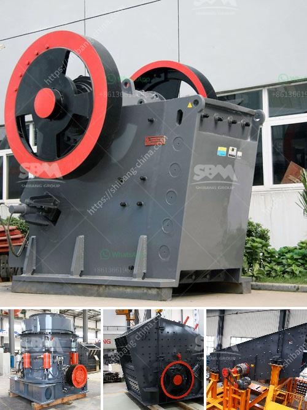

<h3>diagram of gold wash plant</h3>
A diagram of a gold wash plant can be a great tool for understanding the process of gold mining. This plant is used for washing and separating gold from the ores and rocks that contain it. The diagram for this plant can be quite complex, but it is worth understanding the basics of how it works.

The first step in a gold wash plant is to feed the ore into a hopper where it is mixed with water. This water and ore mixture is then fed into a trommel, which is a large rotating drum that separates the gold from the rest of the material. As the trommel rotates, the heavy gold particles sink to the bottom and are collected in the gold recovery sluice boxes.

The diagram of a gold wash plant will also typically include a vibrating screen or grizzly, which is used to remove larger rocks and debris from the ore. This process helps to ensure that the gold particles are at an optimal size for the recovery process. After passing through the vibrating screen, the small gold particles are fed into the gold recovery sluice boxes.

These sluice boxes are lined with riffles, which are ridges or grooves that help to capture the gold particles. The water and material flow down the sluice boxes, with the gold particles settling in the riffles, while the lighter material is carried away. The processed material then exits the sluice boxes through a series of riffle sets, where further concentration of the gold particles occurs.

Once the gold particles have been collected in the sluice boxes, they can be further processed to separate the gold from the other materials. This is often done using a gold concentrator or blue bowl, which uses centrifugal force to separate the gold from the other materials. The gold is collected in a bowl or cone-shaped device, while the remaining material is discharged.

The diagram of a gold wash plant may also include a cyanide or mercury-based leaching circuit, where the gold particles are chemically treated to dissolve them into a solution. This process helps to further separate the gold from the other materials and is often used in large-scale gold mining operations.

In conclusion, a diagram of a gold wash plant can be a valuable tool in understanding the process of gold mining. It shows the various components and steps involved in the washing and extraction of gold from its ore. While the diagram may be complex, it provides a comprehensive overview of the gold wash plant and its operations. This understanding can help individuals or companies make informed decisions about gold mining and processing.
<h3>Contact us</h3><ul><li><strong>Whatsapp:&nbsp;<a href="https://wa.me/8613661969651">+8613661969651</a></strong></li><li><a href="https://swt.shibang-china.com/?git&amp;zhl&amp;diagram of gold wash plant"><strong>Online Service(chat now)</strong></a></li></ul><h3>Related</h3><ul><li><a href='mining equipment for sale.md'>mining equipment for sale</a></li><li><a href='vibrating crushing plant.md'>vibrating crushing plant</a></li><li><a href='barite mining crusher process.md'>barite mining crusher process</a></li><li><a href='modular mineral processing plant.md'>modular mineral processing plant</a></li><li><a href='quarry stone machine in uk.md'>quarry stone machine in uk</a></li></ul>