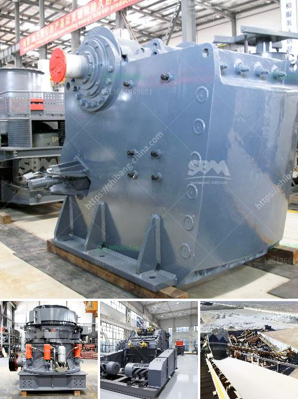

<h3>diagram of vertical hammer mill</h3>
A hammer mill is a mill whose purpose is to shred or crush aggregate material into smaller pieces by the repeated blows of little hammers. These machines have many sorts of applications in many industries, including grinding milling and road-building. A vertical hammer mill is essentially a steel drum containing a vertical or horizontal rotating shaft or drum on which hammers are mounted. The hammers rotate at high speed through the belt, which when mounted on the rotor shaft fling the material towards the stationary hammer. As the material passes over the lining plate installed on the rotor, it is crushed by the continuous blows of the hammer.

As can be seen from the figure, the vertical hammer mill consists of a hammer shaft 11 mounted on a rotor disc. It is enclosed within a drum 12, which is lined with wear-resistant lining plates. The raw material enters the mill through the feed chute and is impacted by the hammers. The crushed material then falls through the grid plate 13 at the bottom of the drum and is collected in a discharge chute.

The advantages of a vertical hammer mill are many. First, it takes up less space compared to a horizontal hammer mill, making it suitable for small-scale operations or limited spaces. Second, the vertical arrangement of the hammers allows for a more efficient and even distribution of the crushing force on the material, resulting in a uniform grind. Third, the use of wear-resistant lining plates ensures a longer lifespan of the mill, reducing maintenance and replacement costs.

The vertical hammer mill is commonly used in industries such as mining, chemical, metallurgy, construction, and biomass energy conversion. It can crush various materials into finer particles, including coal, limestone, gypsum, phosphate, salt, and wood chips. The fine particles produced by the mill can be used as fuel for boilers or as raw materials for various industries.

In conclusion, the diagram of a vertical hammer mill illustrates the various components and operation of this versatile machine. Its compact design, efficient crushing force distribution, and wear-resistant lining plates make it a reliable and cost-effective solution for size reduction in various industries. Whether for grinding, milling, or road-building, the vertical hammer mill is a valuable tool in many applications.
<h3>Contact us</h3><ul><li><strong>Whatsapp:&nbsp;<a href="https://wa.me/8613661969651">+8613661969651</a></strong></li><li><a href="https://swt.shibang-china.com/?git&amp;zhl&amp;diagram of vertical hammer mill"><strong>Online Service(chat now)</strong></a></li></ul><h3>Related</h3><ul><li><a href='cost of grizzly crusher.md'>cost of grizzly crusher</a></li><li><a href='calcium carbonate process flow diagram.md'>calcium carbonate process flow diagram</a></li><li><a href='crusher on rent basis in nigeria.md'>crusher on rent basis in nigeria</a></li><li><a href='small crusher malaysia.md'>small crusher malaysia</a></li><li><a href='copper concentrate mobile crusher.md'>copper concentrate mobile crusher</a></li></ul>