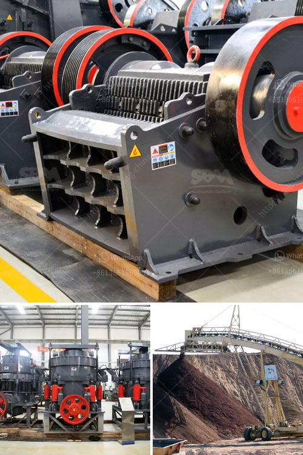

<h3>diamants usine de lavage mobiles</h3>
Diamonds are one of the world’s most precious and sought-after gemstones, symbolizing wealth, beauty, and luxury. However, the journey from their rough form to a dazzling, polished gemstone involves several stages of processing. One crucial step in this process is the use of mobile washing facilities, which ensure the efficient and effective cleaning of diamonds. These mobile washing factories play a significant role in the diamond mining industry, facilitating the transformation of raw diamonds into exquisite treasures.

A diamond mobile washing facility, also known as a “diamants usine de lavage mobiles” in French, is a specialized unit designed to clean and process diamonds in remote or off-site locations. It offers diamond mine operators the convenience and efficiency of on-site processing without having to transport the raw diamonds to a central facility.

Mobile washing facilities are equipped with state-of-the-art diamond processing technologies, allowing for the thorough cleaning and sorting of diamonds. These facilities typically employ a combination of high-pressure water jets, screens, and separation techniques to remove dirt, mud, and other impurities from the rough diamonds. The vigorous washing process not only cleans the diamonds but also helps to reveal their true quality and characteristics, such as size, color, and clarity.

One of the key advantages of mobile washing facilities is their flexibility. They can be easily transported to different mining sites, enabling the diamond miners to process their product on-site and minimize transportation costs. This flexibility is particularly beneficial in remote or inaccessible regions where the availability of infrastructure and resources is limited. By bringing the cleaning and processing capabilities to the diamond mines, these mobile washing facilities ensure a more efficient and streamlined operation.

Furthermore, mobile washing facilities contribute to the sustainability and environmental responsibility of the diamond mining industry. Their water recycling and filtration systems minimize water usage and prevent pollution of nearby water bodies. This ensures that the ecosystem surrounding the mining site remains unaffected, demonstrating the industry's commitment to responsible mining practices.

The introduction of mobile washing facilities has revolutionized the diamond mining industry. It has enabled miners to increase their productivity, reduce operational costs, and improve the overall quality of their product. The ability to clean and process rough diamonds on-site ensures that the valuable mineral resources are utilized efficiently and effectively, contributing to the economic growth and prosperity of the diamond mining regions.

In conclusion, mobile washing facilities, or “diamants usine de lavage mobiles,” are essential components of the diamond mining industry, facilitating the cleaning and processing of diamonds on-site. Their flexibility, efficiency, and environmental responsibility make them invaluable assets to diamond mine operators. As the demand for diamonds continues to rise, the use of mobile washing facilities will play an increasingly crucial role in the transformation of raw, unpolished diamonds into exquisite treasures that capture the hearts and desires of people worldwide.
<h3>Contact us</h3><ul><li><strong>Whatsapp:&nbsp;<a href="https://wa.me/8613661969651">+8613661969651</a></strong></li><li><a href="https://swt.shibang-china.com/?git&amp;zhl&amp;diamants usine de lavage mobiles"><strong>Online Service(chat now)</strong></a></li></ul><h3>Related</h3><ul><li><a href='cost of mobile stone crusher.md'>cost of mobile stone crusher</a></li><li><a href='grinder rock crusher.md'>grinder rock crusher</a></li><li><a href='stone crusher finding.md'>stone crusher finding</a></li><li><a href='mobile chrome ore plant.md'>mobile chrome ore plant</a></li><li><a href='crushing plants in malaysia.md'>crushing plants in malaysia</a></li></ul>