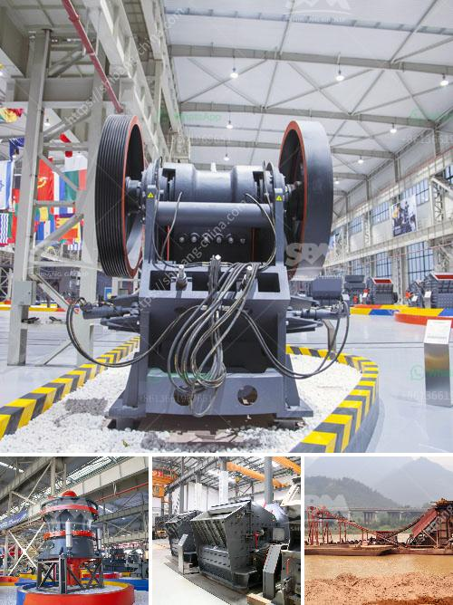

<h3>diamond mining jaw crusher</h3>
Diamond mining is an intensive process that requires the use of advanced equipment to extract and process the ore. One of the most important pieces of equipment in this process is the jaw crusher. This is a slight deviation from traditional rock crushers, as it is designed to handle both primary and secondary crushing, depending on the hardness of the raw material. 

The jaw crusher is an essential piece of equipment that helps to reduce the size of large rocks and ores into smaller, more manageable pieces. This is especially important as diamond ore is often found in large deposits that can be difficult to extract. With the help of a jaw crusher, miners can break down the ore into smaller pieces, making it easier to transport and process.

One of the key advantages of a jaw crusher is its versatility. Depending on the specific needs of the mining operation, the jaw crusher can be used for both primary and secondary crushing. In primary crushing, the raw material is fed into the crusher through a vibrating grizzly feeder. The jaw crusher then crushes the material further, reducing its size to a manageable level. In secondary crushing, the crushed material is sent to a secondary cone crusher for further reduction before being processed further.

In addition to its versatility, the jaw crusher also offers several other benefits for diamond mining operations. It is a reliable and robust machine that can withstand the harsh conditions of a mining site. Its simple design allows for easy maintenance and repair, ensuring minimal downtime. Furthermore, the jaw crusher has a high crushing ratio, meaning it can produce more consistent and uniform-sized particles, resulting in higher-quality output.

Overall, the jaw crusher plays a crucial role in diamond mining operations. Its ability to handle both primary and secondary crushing, as well as its reliability and easy maintenance, make it an essential piece of equipment. With the help of a jaw crusher, miners can efficiently extract and process diamond ore, leading to increased productivity and profitability in the mining industry.
<h3>Contact us</h3><ul><li><strong>Whatsapp:&nbsp;<a href="https://wa.me/8613661969651">+8613661969651</a></strong></li><li><a href="https://swt.shibang-china.com/?git&amp;zhl&amp;diamond mining jaw crusher"><strong>Online Service(chat now)</strong></a></li></ul><h3>Related</h3><ul><li><a href='mineral cribado cantera planta trituradora.md'>mineral cribado cantera planta trituradora</a></li><li><a href='charcoal crusher kenya.md'>charcoal crusher kenya</a></li><li><a href='grinding and mixing machine for quartz.md'>grinding and mixing machine for quartz</a></li><li><a href='cs cone crusher.md'>cs cone crusher</a></li><li><a href='mobile crusher triman.md'>mobile crusher triman</a></li></ul>