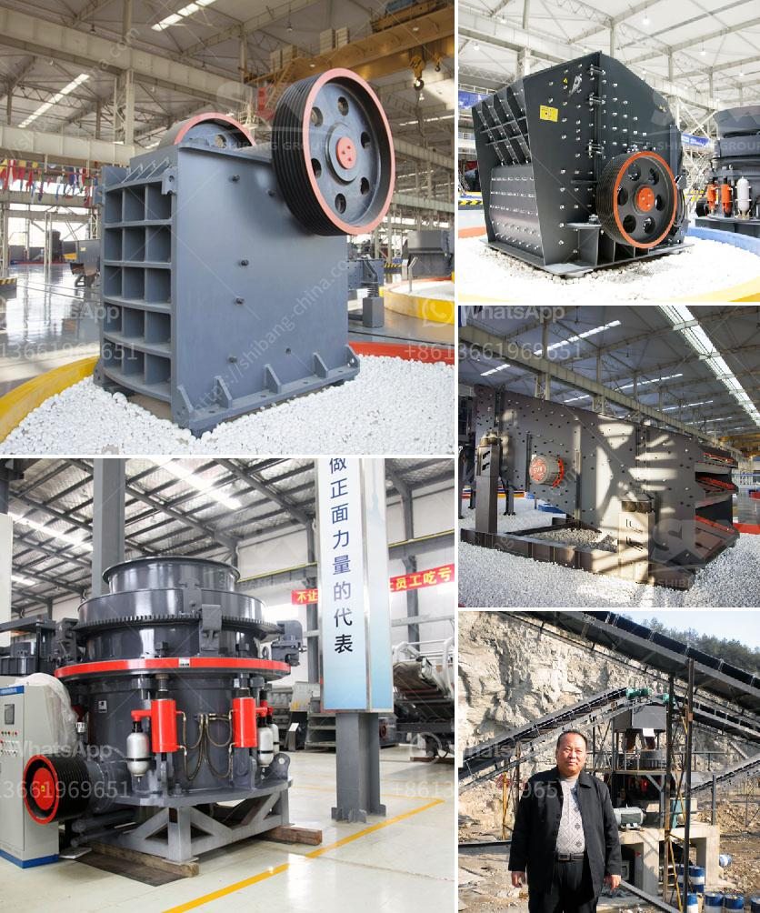

<h3>diamond river mining equipment in china</h3>
Diamond river mining is a form of artisanal mining that occurs on the bed or banks of rivers. The diamonds which had been naturally formed in ancient volcanic kimberlite pipes that are eroded over millions of years and carried by the river downstream. China, being the world's largest producer of synthetic diamonds, is also known for its diamond river mining equipment.

In the last few decades, China has witnessed a significant increase in diamond river mining activities, primarily due to the rising demand for diamonds worldwide. To cater to this demand, Chinese manufacturers have developed advanced and efficient mining equipment specifically designed for diamond river mining.

One of the key pieces of equipment used in diamond river mining is the dredge. These dredges are floating platforms equipped with excavating machinery, which is used to extract diamonds and other precious minerals from the riverbed. The dredges employ complex mechanisms such as suction hoses, underwater pumps, and classifiers to separate the valuable minerals from the sediments.

Chinese manufacturers have utilized their technological expertise to produce highly efficient and cost-effective dredges for diamond river mining. These dredges are built using durable materials, ensuring their longevity and performance in challenging river environments. Moreover, they are equipped with advanced onboard systems that allow for precise control and optimization of the mining process.

Additionally, Chinese manufacturers have also developed specialized diamond recovery systems to further enhance the efficiency of diamond river mining. These systems use a combination of gravity separation, vibration, and water currents to separate diamonds from other materials. The recovered diamonds are then further processed to ensure their quality and value.

China's expertise in diamond river mining equipment has positioned it as a leading player in the global diamond industry. Its technologically advanced machinery has revolutionized the process of diamond extraction from riverbeds. As the world's demand for diamonds continues to grow, China's diamond river mining equipment serves as a vital tool for meeting this demand while contributing to the country's economic growth.
<h3>Contact us</h3><ul><li><strong>Whatsapp:&nbsp;<a href="https://wa.me/8613661969651">+8613661969651</a></strong></li><li><a href="https://swt.shibang-china.com/?git&amp;zhl&amp;diamond river mining equipment in china"><strong>Online Service(chat now)</strong></a></li></ul><h3>Related</h3><ul><li><a href='marble quarry equipment.md'>marble quarry equipment</a></li><li><a href='mobile copper ore shaking table.md'>mobile copper ore shaking table</a></li><li><a href='ball mill zenit crusher china.md'>ball mill zenit crusher china</a></li><li><a href='mill grinding machines for sale.md'>mill grinding machines for sale</a></li><li><a href='cost of a stone crusher.md'>cost of a stone crusher</a></li></ul>