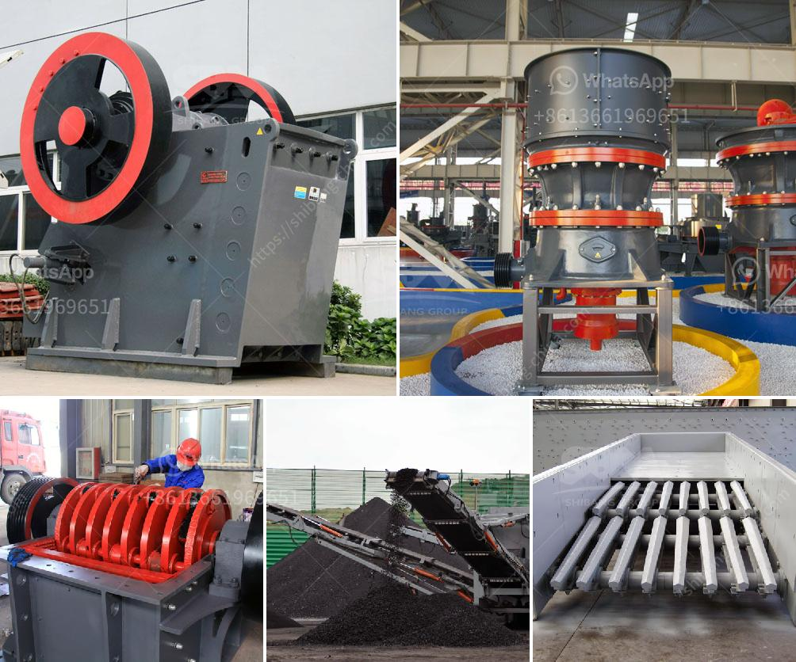

<h3>diatomaceous earth processing machinery</h3>
Diatomaceous earth (DE), also known as diatomite, is a naturally occurring sedimentary rock with numerous industrial applications. It is highly valued for its unique properties, including high porosity, high surface area, and excellent absorbent qualities. As a result, the demand for diatomaceous earth has been steadily increasing across various industries such as agriculture, pharmaceuticals, filtration, and pet care.

To meet this growing demand and ensure efficient production, diatomaceous earth processing machinery has become an essential tool for manufacturers. These machines can significantly enhance productivity, reduce labor costs, and ensure the quality and consistency of the final product. Let us delve into the various aspects of diatomaceous earth processing machinery and their significance.

One of the primary stages in the processing of diatomaceous earth is size reduction. This process involves crushing or milling the mined diatomite into a fine powder. Specialized machinery, such as jaw crushers, impact crushers, or hammer mills, can efficiently reduce the size of diatomite particles, ensuring a consistent and uniform product.

After size reduction, the next crucial step is classification. This involves separating the diatomaceous earth particles based on size. Air classifiers are commonly employed in the diatomite industry to accomplish this task. These machines use the principle of fluidization combined with centrifugal force to separate the particles into various size fractions.

Once the diatomite particles have been classified, further processing steps such as calcination or activation may be required based on the desired properties of the end product. In these processes, diatomaceous earth processing machinery such as rotary calciners or flash dryers can be utilized. These machines apply controlled heat or intense drying to alter the physical characteristics of diatomite, thereby enhancing its absorbency, filtration capabilities, or other desired properties.

Additionally, packaging and bagging machinery is necessary to ensure efficient packaging and transportation of the final diatomaceous earth products. These machines can automatically fill and seal bags, cans, or other containers, minimizing manual labor and optimizing packaging speed.

In conclusion, diatomaceous earth processing machinery plays a vital role in the efficient and effective production of diatomite-based products. From size reduction to classification, and further processing to packaging, these machines enable manufacturers to meet the increasing demand for diatomaceous earth while ensuring high-quality products. Investing in state-of-the-art diatomaceous earth processing machinery is therefore crucial for businesses looking to stay competitive in this rapidly growing industry.
<h3>Contact us</h3><ul><li><strong>Whatsapp:&nbsp;<a href="https://wa.me/8613661969651">+8613661969651</a></strong></li><li><a href="https://swt.shibang-china.com/?git&amp;zhl&amp;diatomaceous earth processing machinery"><strong>Online Service(chat now)</strong></a></li></ul><h3>Related</h3><ul><li><a href='big crusher stones east london south africa.md'>big crusher stones east london south africa</a></li><li><a href='gold milling plant in zimbabwe.md'>gold milling plant in zimbabwe</a></li><li><a href='price of zenith mining.md'>price of zenith mining</a></li><li><a href='sand crushing machine.md'>sand crushing machine</a></li><li><a href='crusher stone prices.md'>crusher stone prices</a></li></ul>