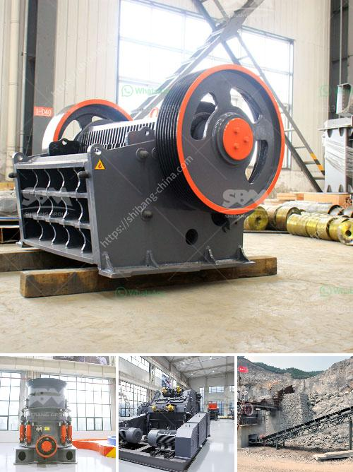

<h3>difference between ball mills and tube mills</h3>
Ball mills and tube mills are two grinding machines with similar working principles, but there are several key differences between them. The following article clarifies the difference between the two:

Ball mill is a horizontal machine, which is used to grind materials into a fine powder. The material is crushed by the steel balls inside the cylinder. The ball mill is often preferred by operators over alternative grinding systems because of its ability to grind materials into fine particles and its efficiency in energy consumption.

Tube mills are similar to ball mills, but instead of using grinding balls, they use long steel rods to do the grinding process. Tube mills work in a similar manner to ball mills, but liquid media is sometimes added during the grinding process to help contain the finer particles as they are being ground.

There are several key differences between ball mills and tube mills, making them uniquely suited for a variety of jobs. Some of the main differences are summarized below:

A ball mill consists of a horizontal rotating cylinder filled with steel balls. The material is ground between the balls as they tumble. Tube mills, on the other hand, have a series of horizontal sections called chambers, with different sized grinding media.

In ball mills, the material is crushed or ground by impact and attrition. The degree of particle size reduction in a ball mill is influenced by the residence time of the material in the mill chamber, the size, density, and number of the balls. In contrast, tube mills are designed with an initial churning motion followed by grinding action. The grinding media in a tube mill are spherical and have a medium to high attrition rate.

Tube mills have a higher specific energy consumption (energy per unit mass of material) compared to ball mills. This means that, on average, more energy is required to grind material in a tube mill than in a ball mill.

Ball mills accept feed in the size range 6.4 to – 25 mm (¼ to -1 inch) and produce a product in the size range of 3000 to – 270 mm (–4 to –35 mesh). Tube mills have a larger feed size and produce a product in the size range of 3000 to – 400 mm (–4 to –35 mesh).

Both ball mills and tube mills are capable of grinding a wide range of materials, but tube mills have a greater capacity for grinding materials of high hardness and low grindability.

In conclusion, ball mills and tube mills are two grinding machines with similar working principles but have different construction, material grinding processes, energy efficiency, feed sizes, product sizes, and capacities. The choice between a ball mill and tube mill depends on the desired particle size, the feed material's hardness, and other factors specific to the application.
<h3>Contact us</h3><ul><li><strong>Whatsapp:&nbsp;<a href="https://wa.me/8613661969651">+8613661969651</a></strong></li><li><a href="https://swt.shibang-china.com/?git&amp;zhl&amp;difference between ball mills and tube mills"><strong>Online Service(chat now)</strong></a></li></ul><h3>Related</h3><ul><li><a href='copper ore conveying system.md'>copper ore conveying system</a></li><li><a href='250tph complete crushing plant.md'>250tph complete crushing plant</a></li><li><a href='crasher sand machine south africa.md'>crasher sand machine south africa</a></li><li><a href='hydraulic system loesche mill.md'>hydraulic system loesche mill</a></li><li><a href='zevith simple stone crushers kenya.md'>zevith simple stone crushers kenya</a></li></ul>