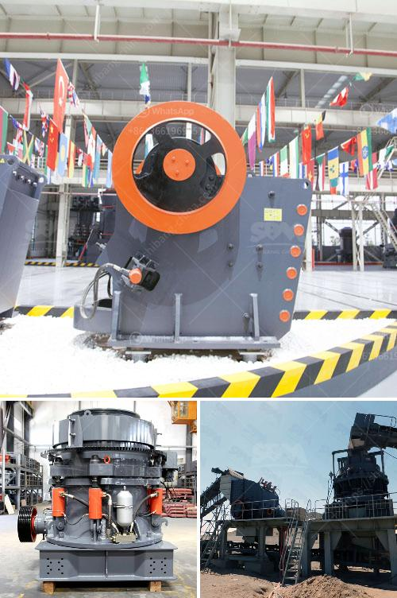

<h3>difference between pebble and rock</h3>
When it comes to nature's treasures, pebbles and rocks are often misunderstood and mistaken for one another. Although both may appear similar at first glance, there are significant differences between pebbles and rocks that set them apart.

Size is the primary distinguishing factor between pebbles and rocks. Pebbles are generally smaller than rocks, typically ranging from 2 to 64 millimeters in diameter. They are often smooth and round, formed by natural erosion and weathering. On the other hand, rocks are larger and can vary greatly in size. Rocks can be as small as a pebble or as massive as a mountain, showcasing a wide range of shapes and textures.

Composition is another critical factor in differentiating pebbles from rocks. Pebbles are usually made of compacted sediment, such as sand or smaller rocks. Their smooth and polished appearances are a result of being tumbled in water bodies like rivers or oceans. Rocks, on the other hand, can be composed of various minerals, including granite, basalt, limestone, or even volcanic or metamorphic materials. Rocks contain a matrix within their structure that serves as a binding agent for these minerals.

Formation processes are also divergent between pebbles and rocks. Pebbles form from the continuous movement of water or wind eroding softer rocks into smaller fragments. They can also occur naturally when sediments settle and compress over time. In contrast, rocks are formed through geological processes like volcanic activity, metamorphosis, or sediment deposition. These processes take place over extended periods, involving immense pressures and temperatures, resulting in the creation of distinct rock formations.

In conclusion, while pebbles and rocks may share a few resemblances, the differences between them are apparent. Pebbles are smaller, smoother, and formed through erosion, while rocks come in a broader size range, possess various textures, and are formed through geological processes. Understanding these disparities allows us to appreciate the intricate beauty and versatility of nature's creations.
<h3>Contact us</h3><ul><li><strong>Whatsapp:&nbsp;<a href="https://wa.me/8613661969651">+8613661969651</a></strong></li><li><a href="https://swt.shibang-china.com/?git&amp;zhl&amp;difference between pebble and rock"><strong>Online Service(chat now)</strong></a></li></ul><h3>Related</h3><ul><li><a href='small scale stone crusher price list.md'>small scale stone crusher price list</a></li><li><a href='portable sand grinding machine.md'>portable sand grinding machine</a></li><li><a href='mills price of hammer mills.md'>mills price of hammer mills</a></li><li><a href='best mills for barite.md'>best mills for barite</a></li><li><a href='zevith simple stone crushers kenya.md'>zevith simple stone crushers kenya</a></li></ul>