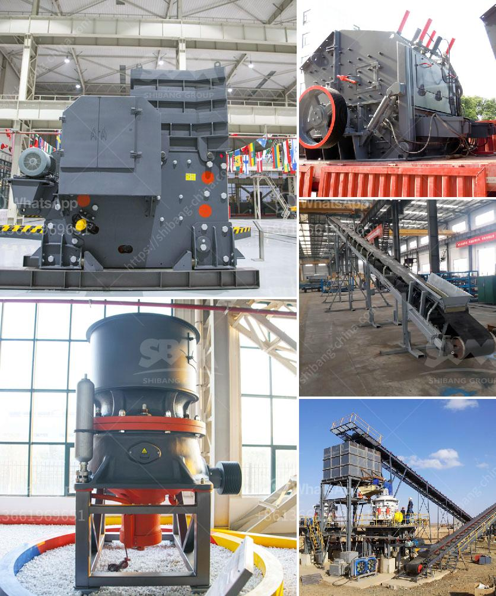

<h3>difference between pulveriser and</h3>
In industries where size reduction of materials is necessary, two common machines that come to mind are the pulverizer and the grinder. These two machines have distinct differences despite serving similar purposes. This article aims to shed light on the difference between a pulverizer and a grinder.

A pulverizer, also known as a pulverizer machine, is used to smash materials into tiny shards or granules. It is commonly used in industries such as mining, metal processing, and agriculture to reduce the size of materials such as raw ore, coal, and plant debris. This allows for easier processing and transportation of these materials.

One of the key features of a pulverizer is its ability to handle both wet and dry materials. It has specially designed blades or hammers that rotate at high speeds, creating a powerful impact force. As the material comes into contact with these blades or hammers, it is shattered into smaller pieces. The pulverizer can then separate the desired size particles from the rest using a combination of screens and air classifiers.

A grinder, on the other hand, is a machine that is used to grind materials into smaller particles. Unlike a pulverizer, a grinder usually works with a grinding wheel or wheel-like tool that rotates at a high speed. This wheel or tool contains abrasive grains that are used to grind materials into the desired shape or size.

Grinders are commonly used in industries such as woodworking and metalworking to shape, sharpen, or polish materials. They are also widely used in the food industry to process various food items such as grains, coffee beans, and spices. Grinders can also be found in households in the form of coffee grinders or spice grinders.

While both pulverizers and grinders serve similar purposes, there are a few key differences between the two. Firstly, pulverizers are generally used to process larger materials, while grinders are used mainly for smaller materials. This is because the grinding wheel or tool in a grinder has limited space to work with, making it suitable for smaller-sized materials.

Secondly, pulverizers are typically more powerful and capable of handling tougher materials compared to grinders. This is due to the rotating blades or hammers in a pulverizer that create a stronger impact force. Grinders, on the other hand, rely on the abrasive grains on the grinding wheel to break down materials, which may not be as effective for hard or dense materials.

Lastly, pulverizers have the ability to separate different sizes of particles from the material being processed. This is done using screens or air classifiers that allow the desired size particles to pass through while the larger particles are retained for further processing. Grinders, on the other hand, do not have this separation capability and simply reduce materials to a smaller size without sorting them.

In conclusion, the main difference between a pulverizer and a grinder lies in their size reduction capabilities and materials they can handle. Pulverizers are more powerful, capable of handling larger and tougher materials while also providing size separation. Grinders, on the other hand, are more suitable for smaller materials and do not have the ability to separate different sizes. Ultimately, the choice between a pulverizer and a grinder depends on the specific needs of the industry or application at hand.
<h3>Contact us</h3><ul><li><strong>Whatsapp:&nbsp;<a href="https://wa.me/8613661969651">+8613661969651</a></strong></li><li><a href="https://swt.shibang-china.com/?git&amp;zhl&amp;difference between pulveriser and"><strong>Online Service(chat now)</strong></a></li></ul><h3>Related</h3><ul><li><a href='cost of graphite beneficiation plant.md'>cost of graphite beneficiation plant</a></li><li><a href='stone crusher design.md'>stone crusher design</a></li><li><a href='black stone crusher.md'>black stone crusher</a></li><li><a href='feldspar grinding machine manufacturers in india.md'>feldspar grinding machine manufacturers in india</a></li><li><a href='ball mill size.md'>ball mill size</a></li></ul>