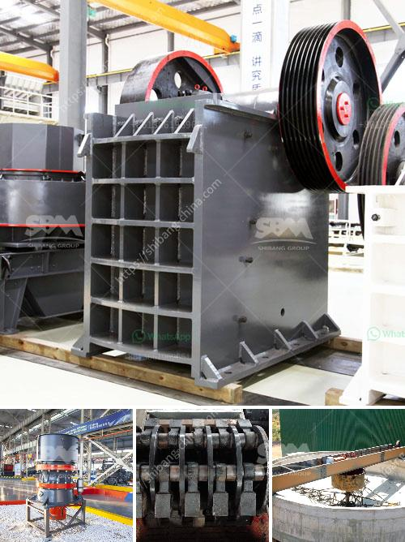

<h3>difference between raymond mill and vertical roller mill</h3>
Raymond Mill and Vertical Roller Mill are two types of mills commonly used in mining, building materials, metallurgy, and other industries. These two mills have many similarities and differences.

In terms of working principles, the difference between Raymond mill and vertical roller mill lies in two aspects. The working principle of Raymond mill is grinding material crushed by grinding roller and grinding ring, while the working principle of vertical roller mill is grinding material by squeezing and grinding. Both Raymond mill and vertical roller mill can be used for cement raw materials grinding, and their working principles have the common point.

Vertical roller mills are not only used for grinding cement raw materials but also find an application in grinding a wide variety of coal types in cement and power plants. Raymond Mill, on the other hand, is more suitable for small and medium-sized mines, chemicals, building materials, metallurgy, refractories, pharmaceuticals, cement and other industries.

In terms of production capacity, Raymond mill is generally higher than the vertical roller mill. The output of Raymond mill varies from 8 tons to 576 tons per hour, while the output of vertical roller mill ranges from 5 tons to 350 tons per hour.

In terms of scope of application, compared with Raymond mill, vertical roller mill has a wider applicable range, which can grind non-metallic mineral materials with Mohs hardness below 7, such as calcite, limestone, marble, talc and ceramic.

In conclusion, Raymond mill and vertical roller mill are both efficient equipment for grinding materials, but there are some differences between them. The vertical roller mill mainly grinds minerals at a high efficiency based on the principle of material bed grinding, while Raymond mill grinds materials by grinding rollers and grinding rings. Moreover, vertical roller mill has wider application scope and higher production capacity than Raymond mill. Therefore, users should choose a suitable mill according to their actual needs.
<h3>Contact us</h3><ul><li><strong>Whatsapp:&nbsp;<a href="https://wa.me/8613661969651">+8613661969651</a></strong></li><li><a href="https://swt.shibang-china.com/?git&amp;zhl&amp;difference between raymond mill and vertical roller mill"><strong>Online Service(chat now)</strong></a></li></ul><h3>Related</h3><ul><li><a href='limestone manufacturing process.md'>limestone manufacturing process</a></li><li><a href='demolition plants crushers in lima.md'>demolition plants crushers in lima</a></li><li><a href='how to build a gold washing plant.md'>how to build a gold washing plant</a></li><li><a href='gold mining mills in south africa.md'>gold mining mills in south africa</a></li><li><a href='crushing  screening plant.md'>crushing & screening plant</a></li></ul>