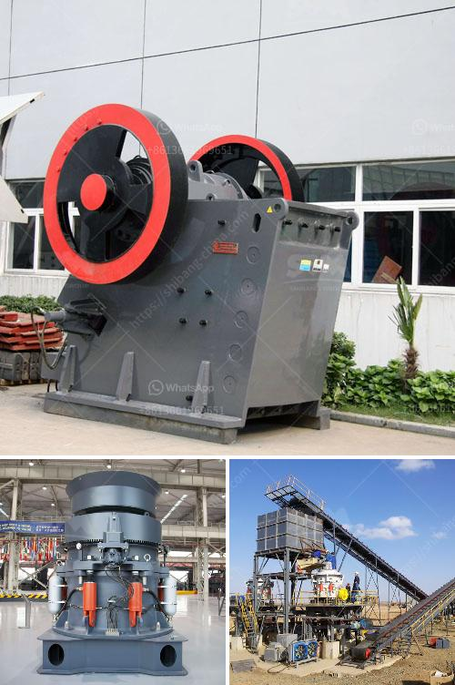

<h3>difference between sand and crushed stone powder</h3>
When it comes to construction projects, there are many materials that are used in various forms. Sand and crushed stone powder are two commonly used materials for construction projects. But what exactly are the differences between these two materials? In this article, we will explore the distinctions between sand and crushed stone powder.

Firstly, let's start with sand. Sand is a naturally occurring granular material composed of finely divided rock and mineral particles. It is primarily made up of tiny fragments of eroded rocks, shells, and other organic materials. Due to its small size and lightweight nature, sand is easily transported and often found in riverbeds, beaches, and deserts.

One of the main applications of sand is its use in concrete production. When mixed with cement and water, sand forms a paste that binds the aggregates and fills the voids between them. This results in a durable and strong concrete mixture. Additionally, sand is commonly used to create mortar, a combination of cement, sand, and water that is used to hold bricks and stones together.

On the other hand, crushed stone powder is a byproduct of the crushing process of rocks like granite and basalt. It is often generated during the extraction and processing of these rock formations. The stone powder is created by crushing large stones into smaller fragments, resulting in a fine, dust-like material.

Crushed stone powder has a variety of applications in construction. It can be used as a base material for paving roads and driveways, as well as for bedding in underground utility lines and pipes. Additionally, crushed stone powder can be mixed with cement to create a high-strength, durable concrete mixture, commonly known as stonecrete.

In terms of physical properties, sand and crushed stone powder have some noticeable differences. Sand has a granular and uneven texture due to the varying shapes and sizes of its particles. This texture allows sand to provide better drainage and reduce the risk of water pooling, making it ideal for areas with high rainfall.

Crushed stone powder, on the other hand, has a smoother texture due to its fine particles. This texture allows it to compact more tightly, resulting in better stability and load-bearing capacity. Thus, crushed stone powder is often used in applications where strength and stability are crucial, such as in the construction of roads and foundations.

Another significant difference between sand and crushed stone powder is their availability and cost. Sand is readily available in various grades and quantities, making it a cost-effective option for construction projects. Crushed stone powder, however, may not be as readily available and its cost can be higher due to its extraction and processing.

In conclusion, while both sand and crushed stone powder are commonly used in construction projects, they have distinct differences. Sand is a naturally occurring granular material that is lightweight and easily transported, while crushed stone powder is a byproduct of the crushing process and has a finer texture. Additionally, sand is commonly used in concrete production, while crushed stone powder is often used for base materials and high-strength concrete mixtures. Consider these differences when choosing the right material for your construction project.
<h3>Contact us</h3><ul><li><strong>Whatsapp:&nbsp;<a href="https://wa.me/8613661969651">+8613661969651</a></strong></li><li><a href="https://swt.shibang-china.com/?git&amp;zhl&amp;difference between sand and crushed stone powder"><strong>Online Service(chat now)</strong></a></li></ul><h3>Related</h3><ul><li><a href='450 tph limestone crusher.md'>450 tph limestone crusher</a></li><li><a href='crusher plant made in pakistan price.md'>crusher plant made in pakistan price</a></li><li><a href='grinder mill bogota.md'>grinder mill bogota</a></li><li><a href='quarrying crusher machine.md'>quarrying crusher machine</a></li><li><a href='price hammer mill price mining.md'>price hammer mill price mining</a></li></ul>