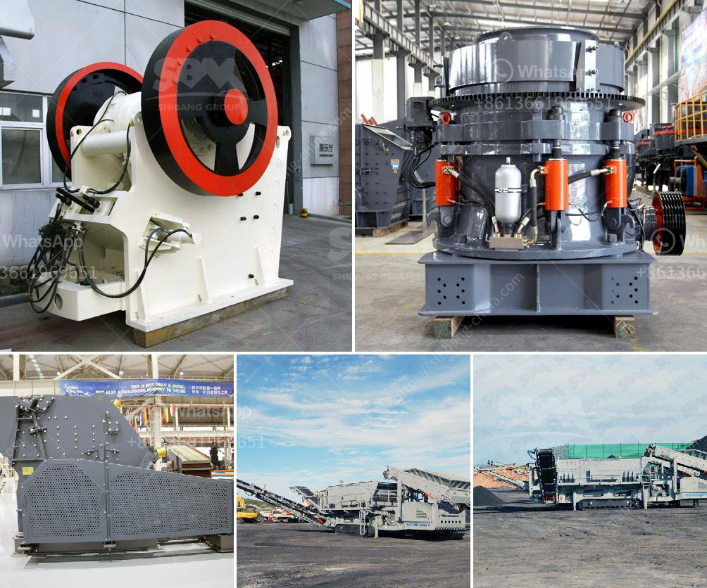

<h3>distribuidor de equipos para laboratorio chancadoras</h3>
Distribuidor de Equipos para Laboratorio Chancadoras: La clave para optimizar los procesos de trituración

En el mundo de la investigación científica y en el ámbito industrial, contar con equipos de laboratorio de calidad es esencial para obtener resultados precisos y confiables. Cuando se trata de la trituración de muestras y materiales, las chancadoras son las herramientas principales utilizadas para reducir el tamaño de las partículas y prepararlas para su análisis posterior.

Un distribuidor de equipos para laboratorio chancadoras se especializa en suministrar estas máquinas indispensables a diferentes sectores, ya sea en la industria minera, farmacéutica, alimentaria, química u otras áreas de investigación. Su objetivo principal es brindar soluciones de trituración precisas y de alta calidad para ayudar a los clientes a optimizar sus procesos y maximizar la eficiencia de sus laboratorios.

Un distribuidor de equipos para laboratorio chancadoras no solo se limita a proporcionar máquinas trituradoras, sino que también ofrece asesoramiento experto sobre cuál es el equipo más adecuado según las necesidades específicas de cada cliente. Estos profesionales se mantienen actualizados sobre las últimas tecnologías y avances en el mercado, lo que les permite recomendar las opciones más eficientes y rentables para cada aplicación.

Además, un distribuidor de equipos para laboratorio chancadoras también ofrece servicios de mantenimiento y reparación para garantizar el funcionamiento óptimo de las máquinas a lo largo del tiempo. Esto es especialmente importante, ya que una trituradora mal mantenida o dañada puede afectar la calidad de los resultados y la productividad del laboratorio.

Al optar por trabajar con un distribuidor de equipos para laboratorio chancadoras, los clientes pueden beneficiarse de varias ventajas importantes:

1. Experiencia y conocimientos técnicos: Estos distribuidores cuentan con un equipo de profesionales expertos en tecnología de trituración y están capacitados para brindar asesoramiento especializado sobre los equipos más adecuados para cada aplicación.

2. Amplia gama de productos: Los distribuidores de equipos para laboratorio chancadoras suelen ofrecer una amplia gama de chancadoras de diferentes tamaños, capacidades y especificaciones técnicas. Esto permite a los clientes encontrar la máquina más adecuada para sus necesidades específicas.

3. Calidad y confiabilidad: Trabajar con un distribuidor confiable garantiza la calidad y confiabilidad de los equipos suministrados. Estas máquinas están diseñadas y fabricadas por marcas reconocidas en el mercado, lo que garantiza su durabilidad y rendimiento.

4. Servicio postventa: Los distribuidores de equipos para laboratorio chancadoras ofrecen servicios de mantenimiento, calibración y reparación para garantizar el funcionamiento óptimo de las máquinas a lo largo del tiempo. Esto prolonga la vida útil de los equipos y minimiza los tiempos de inactividad.

En conclusión, un distribuidor de equipos para laboratorio chancadoras desempeña un papel fundamental al suministrar herramientas de trituración de alta calidad a diferentes sectores de la industria y laboratorios de investigación. Su experiencia técnica, amplia gama de productos y servicios de mantenimiento y reparación garantizan que los clientes puedan optimizar sus procesos de trituración y obtener resultados precisos y confiables en sus investigaciones y procesos industriales.
<h3>Contact us</h3><ul><li><strong>Whatsapp:&nbsp;<a href="https://wa.me/8613661969651">+8613661969651</a></strong></li><li><a href="https://swt.shibang-china.com/?git&amp;zhl&amp;distribuidor de equipos para laboratorio chancadoras"><strong>Online Service(chat now)</strong></a></li></ul><h3>Related</h3><ul><li><a href='top stone crusher companies in india.md'>top stone crusher companies in india</a></li><li><a href='ball mill cement plant.md'>ball mill cement plant</a></li><li><a href='portable cone crusher.md'>portable cone crusher</a></li><li><a href='used crusher for sale in pakistan.md'>used crusher for sale in pakistan</a></li><li><a href='malaysia used conveyor belt for sale.md'>malaysia used conveyor belt for sale</a></li></ul>