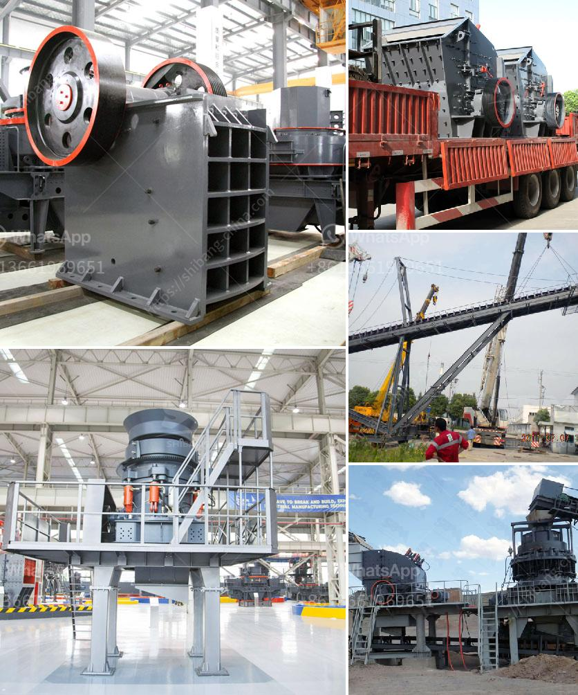

<h3>dolomite crusher manufacturing plant</h3>
Dolomite is one of the leading construction materials and is used worldwide for its excellent properties, making it an ideal choice for the manufacturing industry. With its abundance in nature, it becomes essential to establish manufacturing plants that can produce dolomite-based products efficiently. In this article, we will explore the importance of a dolomite crusher manufacturing plant and its potential.

A dolomite crusher manufacturing plant is a complex process of producing a range of dolomite powders, dolomite aggregates, and dolomite sand that are used for various applications in the construction, agriculture, and industry sectors. This plant often utilizes a versatile set of equipment to achieve the desired product specifications.

Firstly, dolomite stones extracted from quarries are crushed by a primary jaw crusher and then further processed by an impact crusher or cone crusher. These crushers break down the large dolomite rocks into smaller particles, which are then screened to obtain the desired product sizes. By adjusting the size of the discharge opening, different grades of dolomite can be produced.

The manufacturing plant must ensure that the dolomite produced meets the required quality standards. To achieve this, the plant usually includes various processes such as air classification, sorting, and washing equipment. These processes help to remove impurities and improve the purity and quality of the final product.

A well-designed dolomite crusher manufacturing plant can efficiently process dolomite rocks and produce various dolomite products with different particle sizes and chemical compositions. These products can be used as construction aggregates, fillers for concrete and asphalt, soil conditioners in agriculture, fluxing agents in metal smelting, and various other applications.

The establishment of a dolomite crusher manufacturing plant offers several advantages. It allows for the local availability of dolomite-based products, reducing transportation costs and promoting regional economic development. Additionally, the plant creates employment opportunities and enhances the overall infrastructure of the area.

In conclusion, the construction industry heavily relies on dolomite-based products, making the establishment of a dolomite crusher manufacturing plant crucial. This plant provides a cost-effective solution for producing high-quality dolomite products that meet industry standards. The versatility of the plant allows it to cater to different product requirements, ranging from construction aggregates to industrial applications. By investing in such a manufacturing plant, the demand for dolomite products can be met effectively, promoting sustainable growth and development.
<h3>Contact us</h3><ul><li><strong>Whatsapp:&nbsp;<a href="https://wa.me/8613661969651">+8613661969651</a></strong></li><li><a href="https://swt.shibang-china.com/?git&amp;zhl&amp;dolomite crusher manufacturing plant"><strong>Online Service(chat now)</strong></a></li></ul><h3>Related</h3><ul><li><a href='rock crusher portable.md'>rock crusher portable</a></li><li><a href='coal ball mill in india from coal dust.md'>coal ball mill in india from coal dust</a></li><li><a href='manganese washing equipment cost.md'>manganese washing equipment cost</a></li><li><a href='quartz plant in india.md'>quartz plant in india</a></li><li><a href='grinding mill manufacturer in gujrawala pakistan.md'>grinding mill manufacturer in gujrawala pakistan</a></li></ul>