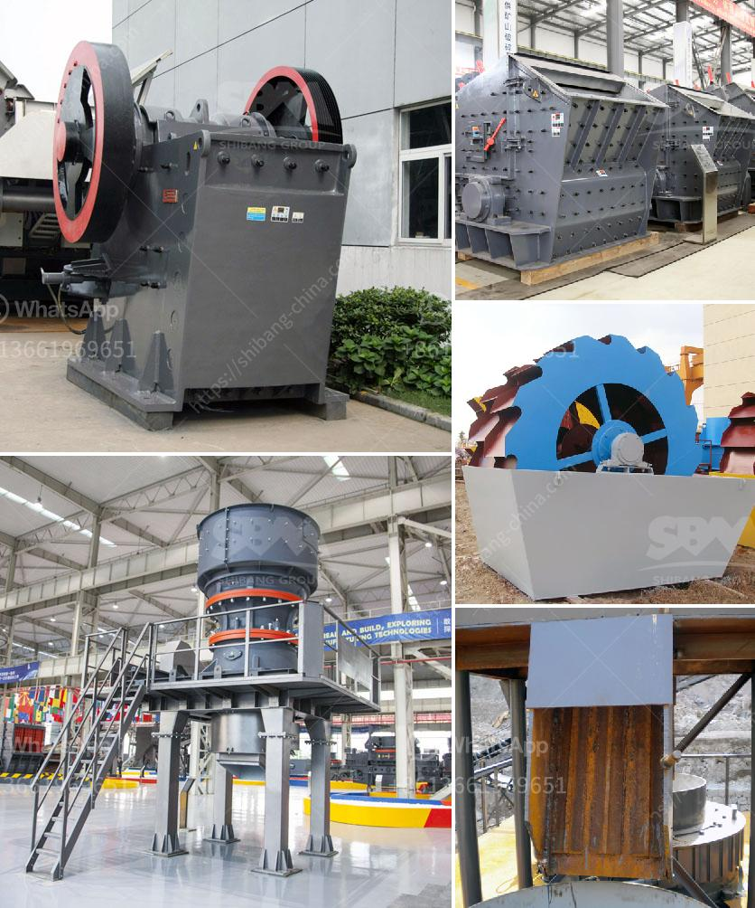

<h3>dolomite crushing plant</h3>
Dolomite is a carbonate mineral composed of calcium magnesium carbonate, which is widely used in various industrial sectors due to its unique properties. It has abundant reserves and high economic value, making it an essential raw material in the construction, ceramics, and agriculture industries.

To meet the growing demand for dolomite, it is important to choose the right equipment and process for the dolomite crushing plant. In general, the dolomite crushing plant includes jaw crusher, cone crusher, impact crusher, and vibrating screen. Jaw crusher is used for primary crushing, and the impact crusher and cone crusher are used for secondary and tertiary crushing.

When choosing the dolomite crushing equipment, it is necessary to select the equipment with high crushing efficiency and low energy consumption to produce dolomite particles with uniform size. Crushing efficiency refers to the ratio of the crushed material to the total output of the crusher. The lower the energy consumption, the higher the crushing efficiency.

In addition to the equipment selection, the process design of the dolomite crushing plant is also very important. After blasting, the dolomite material is evenly fed into the jaw crusher by the vibrating feeder for primary crushing. Then, the crushed dolomite is transported by the belt conveyor to the impact crusher for secondary crushing. After crushing, the dolomite particles are screened by the vibrating screen and sent to the sand washer for cleaning. Finally, the dolomite particles are transported to the finished product warehouse for storage or directly used in various industries.

The dolomite crushing plant designed by our company has the advantages of simple process, high degree of automation, low operating cost, and low investment cost. It is especially suitable for the crushing of dolomite, limestone, and other medium hardness stone materials, which can be easily crushed and processed.

Compared with traditional crushing methods, the dolomite crushing plant has the following advantages:

1. High degree of automation: The whole dolomite crushing plant is controlled by a computer system, which greatly reduces the labor intensity and improves the work efficiency.

2. High crushing efficiency and low energy consumption: The dolomite crushing plant adopts the principle of "stone-on-stone" crushing, which ensures the low wear of parts and reduces the production cost.

3. Good grain shape and uniform size: The dolomite particles crushed by the dolomite crushing plant have good grain shape and uniform size, which is convenient for subsequent processing and utilization.

4. Environmental protection and energy saving: The dolomite crushing plant is equipped with dust removal equipment, which can effectively control the dust emission and meet the environmental protection requirements.

In conclusion, the dolomite crushing plant plays an important role in dolomite production line. It is an ideal crushing equipment for producing dolomite particles with uniform size, high crushing efficiency, and low energy consumption. The dolomite crushing plant designed by our company has been recognized by customers at home and abroad, and enjoys a good reputation in the market. With the continuous development of the construction industry, the demand for dolomite will continue to grow, and the dolomite crushing plant will have a broad market prospect.
<h3>Contact us</h3><ul><li><strong>Whatsapp:&nbsp;<a href="https://wa.me/8613661969651">+8613661969651</a></strong></li><li><a href="https://swt.shibang-china.com/?git&amp;zhl&amp;dolomite crushing plant"><strong>Online Service(chat now)</strong></a></li></ul><h3>Related</h3><ul><li><a href='mobile mini crusher hire.md'>mobile mini crusher hire</a></li><li><a href='talc raymond grinding mill.md'>talc raymond grinding mill</a></li><li><a href='difference between raymond mill and vertical roller mill.md'>difference between raymond mill and vertical roller mill</a></li><li><a href='busines project proposal for stone crusher.md'>busines project proposal for stone crusher</a></li><li><a href='quarry machinery for sale.md'>quarry machinery for sale</a></li></ul>