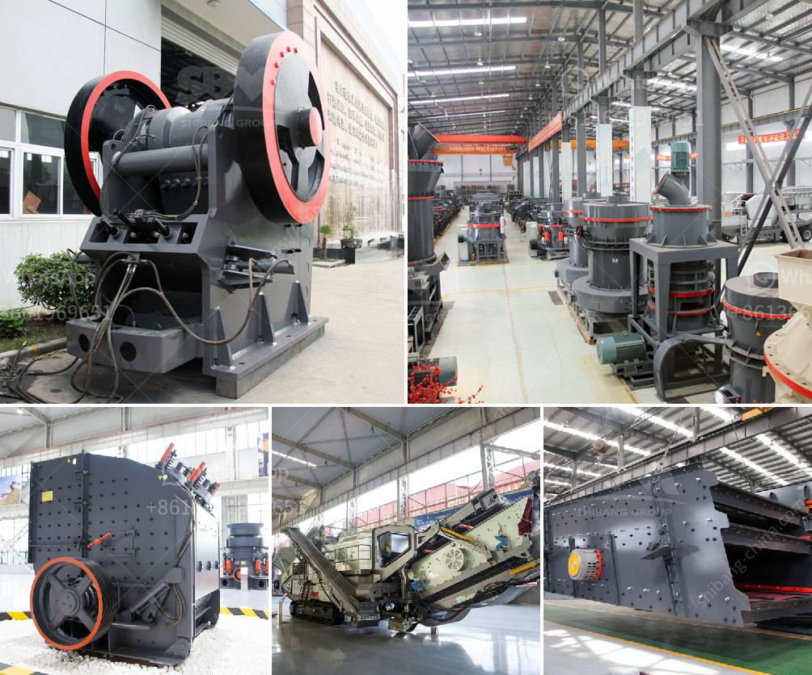

<h3>dolomite powder making equipment</h3>
Dolomite is a carbonate mineral composed of calcium magnesium carbonate. It is a common sedimentary rock-forming mineral that can be found in massive beds several hundred feet thick. Dolomite is used as a soil conditioner and as a feed additive for livestock. It is also used in the manufacture of glass and ceramics. To meet the increasing demand for dolomite, various equipment manufacturers have developed advanced dolomite powder making equipment.

The processing of dolomite requires specialized machinery. Dolomite powder can be used as a raw material for various industries like construction, glass, ceramics, agriculture, etc. Hence, it is crucial to select the appropriate dolomite powder making equipment and system that suits your needs.

One of the essential machines in the dolomite powder making process is grinding mill. Equipment like Raymond mill, ultrafine mill, vertical mill, and other equipment are widely used in the grinding of dolomite. Typically, Raymond mill is suitable for processing size between 30-425 mesh, ultrafine mill is suitable for processing 325-2500 mesh, vertical mill is suitable for processing 80-600 mesh. These grinding mills have different features and advantages, which can meet different production requirements.

The dolomite grinding mill is a key machine used to produce dolomite powder, usually suitable for processing dolomite with a particle size of 80-600 mesh. Dolomite powder can be used in various industries such as construction, ceramics, glass, etc. The dolomite powder making machine is also known as Raymond mill, which is the commonly used grinding equipment in the market.

In addition to the grinding mill, the dolomite powder making equipment also includes a jaw crusher, bucket elevator, vibrating feeder, etc. It is used to crush the raw dolomite into proper size before the grinding process. This equipment is widely used in various fields due to its high crushing efficiency and large crushing ratio. It can process various materials, including dolomite, limestone, granite, etc.

To achieve efficient production of dolomite powder, it is necessary to ensure the stability of the equipment. Regular inspection and maintenance of the dolomite powder making equipment are essential. As the grinding mill operates in a harsh environment, it is prone to wear and tear. Therefore, it is crucial to replace worn parts in time to ensure the stable operation of the equipment.

Furthermore, proper operation of the dolomite powder making equipment is necessary to maximize its efficiency. Operators should follow the operating instructions and operate the equipment correctly. It is also important to pay attention to the production safety and maintain a good working environment.

In conclusion, the dolomite powder making equipment plays a crucial role in the manufacturing process of dolomite powder. It is essential to select the appropriate equipment that suits your needs. Regular inspection and maintenance of the equipment are necessary to ensure its stable operation. By following proper operating procedures, one can maximize the efficiency of the dolomite powder making equipment and achieve high-quality production.
<h3>Contact us</h3><ul><li><strong>Whatsapp:&nbsp;<a href="https://wa.me/8613661969651">+8613661969651</a></strong></li><li><a href="https://swt.shibang-china.com/?git&amp;zhl&amp;dolomite powder making equipment"><strong>Online Service(chat now)</strong></a></li></ul><h3>Related</h3><ul><li><a href='stone crushing plant electro plants.md'>stone crushing plant electro plants</a></li><li><a href='business proposal for stone quarry project.md'>business proposal for stone quarry project</a></li><li><a href='cone crusher for sale philippines.md'>cone crusher for sale philippines</a></li><li><a href='china shanghai zenith company.md'>china shanghai zenith company</a></li><li><a href='mica processing plant per ton.md'>mica processing plant per ton</a></li></ul>