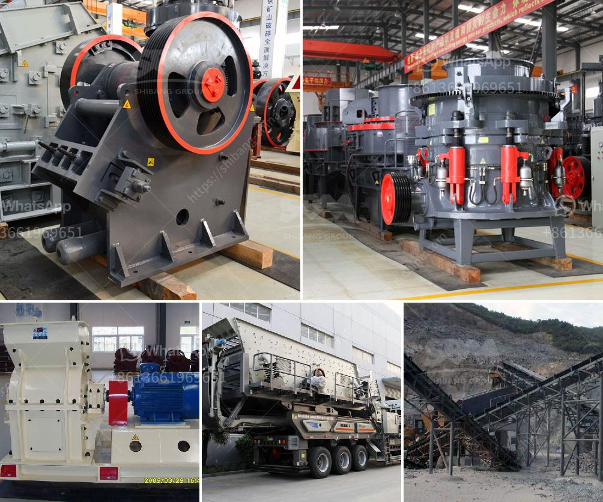

<h3>dolomite powder mill india</h3>
Dolomite powder is a versatile material that can be used in many industries, such as construction, ceramics, glass manufacturing, and agriculture. However, the quality and fineness of the dolomite powder can vary significantly depending on the processing method used. This is where a dolomite powder mill in India becomes crucial to producing high-quality dolomite powder.

The main types of dolomite powder mill in India include ball mill, Raymond mill, ultrafine mill, trapezium mill, vertical mill, and so on. Dolomite powder can be processed through a variety of grinding mills to obtain different fineness. Dolomite powder mill India ball mill for dolomite processing:

Dolomite powder usually is 140 mesh, 325 mesh, 1000 mesh, 1600 mesh. dolomite powder 500 mesh sales - India Crushers. dolomite powder mill,plant india machine Equipment china for sale dolomite powder mill,plant india machine Equipment china for sale Crushing and grinding machine supplier in all of the world: SBM. Get Price! used in stone,gold .

dolomite powder mill price - jakestales.org. Dolomite powder manufacturing machine SKD Heavy Industry . Price Of Dolomite Powder Production Machine in Ethiopia is manufactured from Shanghai ZME . dolomite powder machine Grinding Mill China. Dolomite Powder Machine, Dolomite can be used for building materials, ceramics, glass and refractories, chemicals and agriculture, environmental protection, energy.

Dolomite powder mill India dolomite grinding machines in china Jan 11 2014 and milling machines Shanghai clirik is the most Professional Micro powder grinding mill China Grinding plant for . dolomite powder mill india dolomite powder crusher machine in india– Rock Crusher Mill . ball mill for dolomite powder ball mill is the early grinding mill. and

Dolomite stone grinding mill processing plant Dolomite stone grinding mill processing plantDolomite is kind of carbonate mineral which includes iron dolomite and manganese dolomite. Calcined dolomite can be Gypsum mining equipment,Gypsum grinding mill Gypsum mining equipment,Gypsum grinding millGypsum is a very useful processed material.

The dolomite powder mill India has a high market share because of its advanced structure, stable performance, reliable operation and high grinding efficiency. It has been widely used in chemical industry, metallurgy, building materials, mining and other fields. It is especially suitable for processing various non-flammable and explosive materials with Mohs hardness below 9.3 and humidity below 6%.

Compared with the traditional dolomite powder mill, the dolomite powder mill India has many advantages. It can produce high-fineness powder, and its efficiency and output are higher than that of the traditional mill. It integrates drying, grinding, grading, and conveying, simplifying the production process and saving energy and cost. The dolomite powder mill India is equipped with an explosion-proof device, which can effectively prevent dust explosion and protect the equipment and personnel.

In addition, there are many dolomite powder mill manufacturers in India. Among these manufacturers, SBM, an ISO 9001:2008 certified company, has established a strong reputation in the industry. With more than 30 years of experience, SBM manufactures dolomite powder mill with various capacities and specifications, meeting each customer's unique requirements.

To summarize, the dolomite powder mill India is a reliable and efficient grinding solution that meets customer's needs. It is one of the best choices for dolomite powder production in India.

In conclusion, the dolomite powder mill India is a reliable and efficient grinding solution that meets customer's needs. It offers advanced structure, stable performance, high grinding efficiency, low energy consumption and convenient maintenance. It is widely used in chemical industry, metallurgy, mining, building materials and other fields. With the support of a reliable manufacturer like SBM, customers can confidently invest in a dolomite powder mill India and benefit from its excellent performance.
<h3>Contact us</h3><ul><li><strong>Whatsapp:&nbsp;<a href="https://wa.me/8613661969651">+8613661969651</a></strong></li><li><a href="https://swt.shibang-china.com/?git&amp;zhl&amp;dolomite powder mill india"><strong>Online Service(chat now)</strong></a></li></ul><h3>Related</h3><ul><li><a href='crushing  screening plant.md'>crushing & screening plant</a></li><li><a href='crusher materials cone crusher mining.md'>crusher materials cone crusher mining</a></li><li><a href='rock crusher plant.md'>rock crusher plant</a></li><li><a href='stone pulverizer machine.md'>stone pulverizer machine</a></li><li><a href='dry iron ore processing methods.md'>dry iron ore processing methods</a></li></ul>