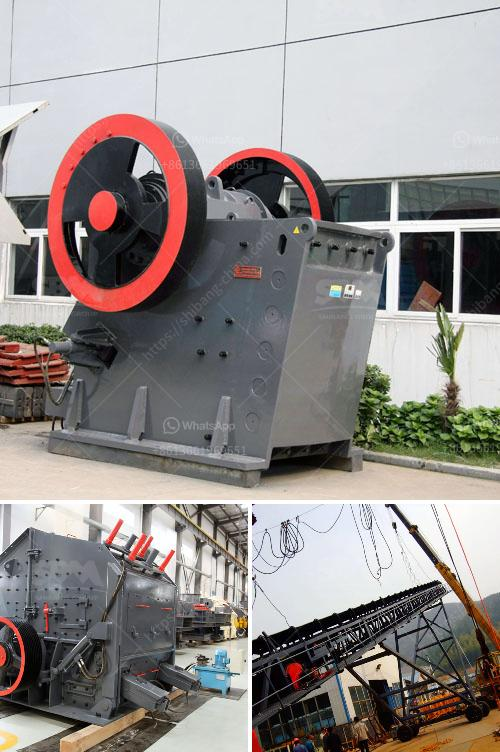

<h3>dolomite production line</h3>
Dolomite is a sedimentary rock rich in mineral content that is commonly found in limestone deposits. Dolomite can be transformed into a variety of products for various industries, including agriculture, construction, and manufacturing. This versatile mineral has wide-ranging applications, and as such, the demand for dolomite production line is continuously growing.

A dolomite production line is essentially a process to convert raw dolomite into useful products. It involves several stages, with crushing and grinding being the primary steps. Once the raw material is extracted, it is crushed to a desirable size and further ground to obtain the desired fineness. This fine powder is then used as a raw material in various applications.

One of the major uses of dolomite is in the agricultural industry. Dolomite is a popular soil conditioner due to its ability to neutralize acidity and provide essential nutrients such as calcium and magnesium. It improves soil structure and enhances the overall fertility of the soil, making it ideal for crop production. The dolomite production line plays a crucial role in meeting the growing demand for high-quality dolomite for agricultural purposes.

Another prominent application of dolomite is in the construction industry. Dolomite is used as an aggregate in concrete and asphalt mixtures, providing strength and durability to structures. Additionally, crushed dolomite is also used as a base material for road construction. The production line ensures a consistent supply of dolomite to meet the requirements of the construction industry.

Furthermore, dolomite is used in the manufacturing of glass and ceramics. It contributes to the transparency and durability of glass products, making it an essential ingredient in glass manufacturing. Dolomite is also widely used in the production of ceramics, providing strength and enhancing the firing properties of the final product.

In conclusion, the dolomite production line is vital for meeting the increasing demand for dolomite in various industries. It ensures the efficient conversion of raw dolomite into valuable products that serve essential purposes in agriculture, construction, and manufacturing. The versatility and wide-ranging applications of dolomite make it an indispensable resource for modern industries.
<h3>Contact us</h3><ul><li><strong>Whatsapp:&nbsp;<a href="https://wa.me/8613661969651">+8613661969651</a></strong></li><li><a href="https://swt.shibang-china.com/?git&amp;zhl&amp;dolomite production line"><strong>Online Service(chat now)</strong></a></li></ul><h3>Related</h3><ul><li><a href='river sand washing machine portable india.md'>river sand washing machine portable india</a></li><li><a href='granite crusher south africa.md'>granite crusher south africa</a></li><li><a href='favrica of ball mills.md'>favrica of ball mills</a></li><li><a href='cconveyor belts class.md'>cconveyor belts class</a></li><li><a href='barite mill in india.md'>barite mill in india</a></li></ul>