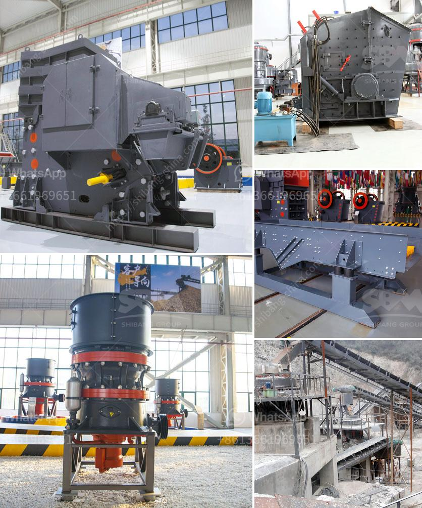

<h3>dolomite production plant</h3>
Dolomite is a mineral that is primarily composed of calcium magnesium carbonate, and it has a wide range of applications in various industries. From construction to agriculture, dolomite is an essential component used to improve the quality of products and enhance their performance. To meet the growing demand for dolomite, production plants have been established worldwide.

Dolomite production plants are facilities designed to extract the mineral from deposits in the earth and process it into a commercial-grade product. These operations involve the use of heavy machinery, such as crushers, ball mills, magnetic separators, and flotation devices, to facilitate the extraction and processing of dolomite ore.

The process of producing dolomite involves several stages. First, the mineral is extracted from the earth through drilling and blasting processes. The extracted ore is then transported to the production plant, where it undergoes crushing and grinding to reduce its size and separate impurities. Magnetic separation is often used to remove any iron or other metallic contaminants present in the ore. Once the desired particle size is achieved, flotation is employed to separate dolomite from other minerals. The final step involves drying and packaging the dolomite powder or granules for distribution.

A well-designed dolomite production plant strives to ensure high-quality output while maximizing efficiency and minimizing environmental impact. This includes implementing dust control measures to reduce airborne particles during processing and using water recycling systems to minimize water consumption. Additionally, the responsible management of waste and by-products generated during the production process is crucial to minimize environmental pollution.

Establishing a dolomite production plant requires comprehensive planning, meticulous site selection, and adherence to all relevant statutory requirements and environmental regulations. The plant should be strategically located near the dolomite deposit to reduce transportation costs and ensure a steady supply of raw materials. Proper infrastructure, including ample storage capacity and efficient logistics systems, is essential to meet market demands effectively.

In conclusion, dolomite production plants play a vital role in meeting the demand for this mineral in various industries. These plants employ advanced technology and efficient processes to extract and process dolomite ore, ensuring high-quality output. Responsible environmental management is of utmost importance in the operation of these plants, ensuring minimal impact on the surroundings. With the growing demand for dolomite, these production facilities are indispensable for supplying the market and contributing to economic growth.
<h3>Contact us</h3><ul><li><strong>Whatsapp:&nbsp;<a href="https://wa.me/8613661969651">+8613661969651</a></strong></li><li><a href="https://swt.shibang-china.com/?git&amp;zhl&amp;dolomite production plant"><strong>Online Service(chat now)</strong></a></li></ul><h3>Related</h3><ul><li><a href='limestone making size.md'>limestone making size</a></li><li><a href='hammer mills in harare zimbabwe.md'>hammer mills in harare zimbabwe</a></li><li><a href='crusher manufacturers in germany.md'>crusher manufacturers in germany</a></li><li><a href='coal crusher suppliers.md'>coal crusher suppliers</a></li><li><a href='ultra fine dry grinding mill.md'>ultra fine dry grinding mill</a></li></ul>