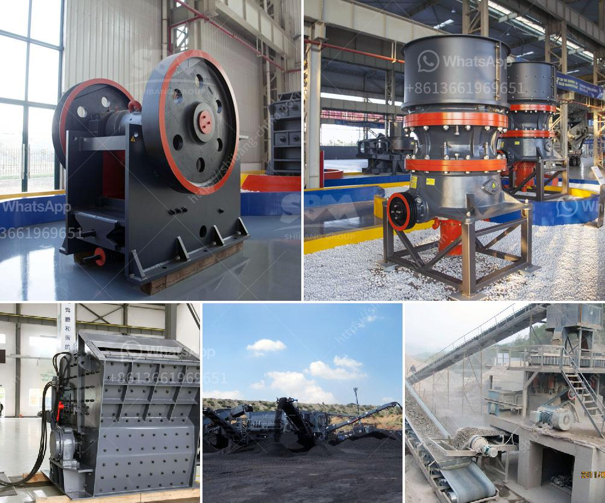

<h3>dolomite stone crusher plant cost</h3>
Dolomite is a natural mineral that is widely used in various industries such as agriculture, construction, and even manufacturing. It is a sedimentary rock that consists mainly of calcium magnesium carbonate, which is widely recognized as one of the most valuable resources in the world.

In recent years, the demand for dolomite has surged significantly, especially in the construction industry. As a result, more and more companies are investing in dolomite stone crusher plants to meet the growing demand of dolomite stones.

Dolomite stone crusher plant cost is relatively cheap, as compared to other mineral crusher plants. However, it does require significant investments to set up a crushing plant. The following is a cost estimate for three different options for dolomite plant:

This option involves the use of a semi-mobile crusher that requires a separate area for storage and transportation of the crushed materials. The total cost involved in setting up a dolomite processing plant includes one-time expenses on machinery, establishment, and infrastructure.

This option involves a larger setup where the dolomite materials are crushed using state-of-the-art equipment in a stationary plant. The total cost involved in setting up a stationary dolomite crusher plant includes one-time expenses on machinery, establishment, and infrastructure.

This option combines a mobile crusher plant with a storage area and can be operated from a single location. The total cost involved in setting up a combined mobile dolomite crusher plant includes one-time expenses on machinery, establishment, and infrastructure.

It is important to note that the cost of setting up a dolomite stone crusher plant is largely dependent on the availability of raw materials and the quantity and quality of the final products. Different companies may have different requirements in terms of the finished products, which can also impact the overall cost.

In addition to the initial setup cost, there are also ongoing operational and maintenance costs associated with running a dolomite stone crusher plant. These costs include electricity, fuel, maintenance, and labor expenses. Therefore, it is crucial to consider these factors while calculating the overall cost of setting up and running a dolomite crusher plant.

Despite the initial investments, setting up a dolomite stone crusher plant can be a profitable venture in the long run. It not only helps meet the growing demand for dolomite stones but also contributes to economic development by creating job opportunities and stimulating local industries.

In conclusion, the cost of setting up a dolomite stone crusher plant is relatively low compared to other mineral crusher plants. However, it still requires substantial investment to start and operate efficiently. The exact cost of setting up a dolomite crusher plant may vary depending on the specific requirements and conditions. Nevertheless, investing in a dolomite stone crusher plant is a good way to generate profits and promote local economic development.
<h3>Contact us</h3><ul><li><strong>Whatsapp:&nbsp;<a href="https://wa.me/8613661969651">+8613661969651</a></strong></li><li><a href="https://swt.shibang-china.com/?git&amp;zhl&amp;dolomite stone crusher plant cost"><strong>Online Service(chat now)</strong></a></li></ul><h3>Related</h3><ul><li><a href='used cement mills for sale in india.md'>used cement mills for sale in india</a></li><li><a href='impact crusher in egypt.md'>impact crusher in egypt</a></li><li><a href='philippines kenya stone crusher.md'>philippines kenya stone crusher</a></li><li><a href='calcium carbonate grinder mill.md'>calcium carbonate grinder mill</a></li><li><a href='granite machine concrete.md'>granite machine concrete</a></li></ul>