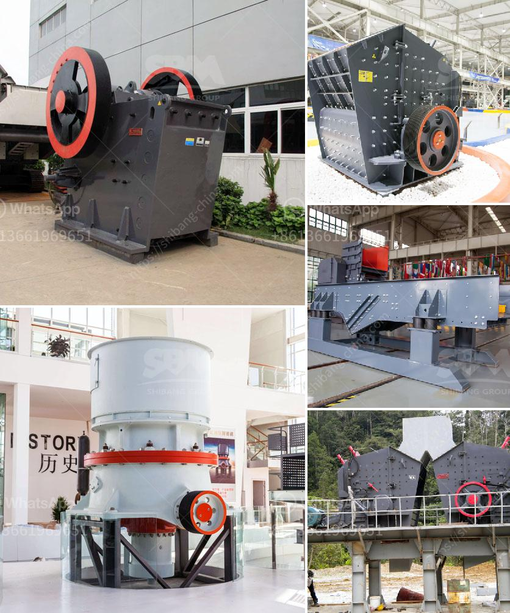

<h3>dolomite to gypsum plants in south africa</h3>
South Africa is home to a plethora of biodiversity, with its fauna and flora ranking among the highest in the world. But one issue that is of major concern to environmentalists and conservationists is the conversion of natural habitats to monoculture plantations. This conversion threatens not only the delicate ecosystem but also the livelihoods of local communities who depend on a healthy and vibrant environment. In recent years, however, there has been a growing movement to transform dolomite mines in South Africa into gypsum production sites. This innovative approach holds promise for restoring habitats, mitigating environmental damage, and boosting the national economy.

Dolomite mines in South Africa traditionally served as a source of mineral wealth for the country. These mines extracted dolomite, a sedimentary rock rich in calcium and magnesium carbonate minerals, to produce fertilizers, construction materials, and industrial chemicals. Dolomite mining, however, often leads to the release of harmful toxins, contaminating the environment and devastating plants and wildlife.

Recognizing the need for environmental remediation, forward-thinking entrepreneurs and organizations began experimenting with transformational techniques. They discovered that dolomite mines could be turned into gypsum production plants, providing valuable by-products to numerous industries while also rehabilitating the land.

Gypsum is a soft sulfate mineral composed of calcium sulfate dihydrate. It has a wide array of applications across industries, including construction, agriculture, and manufacturing. By converting dolomite mines into gypsum production sites, South Africa can effectively address several challenges simultaneously.

First and foremost, these conversions alleviate the environmental concerns associated with dolomite mines. Gypsum production plants utilize a conversion process that effectively reduces the release of harmful toxins and pollutants into the ecosystem. By rehabilitating these previously degraded sites, the process promotes sustainable land use and conserves biodiversity.

Another significant advantage of dolomite to gypsum plants is the economic boost they provide. The utilization of gypsum in various sectors stimulates economic activity by creating job opportunities and expanding local industries. Gypsum is a vital component in building materials such as plaster and drywall, offering a renewed avenue for construction and infrastructure development. Additionally, it can enhance agricultural productivity by improving soil structure and nutrient content.

One successful case study of a dolomite to gypsum transformation is the Phokeng Gypsum Mine located in Rustenburg, North West Province. The mine, formerly a dolomite operation, now serves as a major supplier of gypsum in the region. This conversion not only rectified environmental hazards but also rejuvenated the local economy by providing stable employment opportunities for nearby communities.

While the shift from dolomite mines to gypsum production plants is a commendable step towards environmental sustainability and economic growth, it is crucial to ensure proper regulation and monitoring. Strict environmental guidelines and ongoing assessments must be put in place to mitigate any potential negative impacts of gypsum production. This will ensure that the ecological benefits are maximized, and the local communities can thrive while maintaining a healthy environment.

In conclusion, the conversion of dolomite mines to gypsum plants in South Africa presents a groundbreaking solution to the pressing challenges of environmental degradation and economic stagnation. By harnessing the power of this transformational approach, the country can simultaneously restore vital ecosystems, revitalize local economies, and create sustainable development pathways. With continued research, awareness, and collaboration, dolomite to gypsum conversion could serve as a model for other countries grappling with similar environmental and economic dilemmas.
<h3>Contact us</h3><ul><li><strong>Whatsapp:&nbsp;<a href="https://wa.me/8613661969651">+8613661969651</a></strong></li><li><a href="https://swt.shibang-china.com/?git&amp;zhl&amp;dolomite to gypsum plants in south africa"><strong>Online Service(chat now)</strong></a></li></ul><h3>Related</h3><ul><li><a href='dry calcium carbonate 3 5 micron production.md'>dry calcium carbonate 3 5 micron production</a></li><li><a href='cone crusher for sale philippines.md'>cone crusher for sale philippines</a></li><li><a href='grinding mill for sale zimbabwe.md'>grinding mill for sale zimbabwe</a></li><li><a href='but concrete crushers nigeria.md'>but concrete crushers nigeria</a></li><li><a href='crusher machine for sale in ethiopia.md'>crusher machine for sale in ethiopia</a></li></ul>