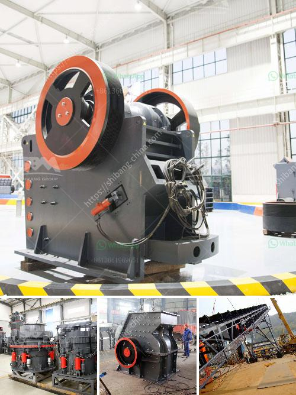

<h3>double jaw crusher</h3>
The double jaw crusher is a popular crushing device in the mining industry. It is mainly used for rough crushing and medium crushing of various materials, such as limestone, granite, basalt, river pebble, and metallurgical slag. It has the advantages of wide application range, high crushing efficiency, low energy consumption, and simple structure. In this article, we will take a closer look at the double jaw crusher and discuss its features, working principle, and main applications.

One of the notable features of the double jaw crusher is its dual-chamber structure. Compared to a traditional single-toggle jaw crusher, the double jaw crusher has two movable jaws and two stationary jaws. The two movable jaws are each connected to an eccentric shaft, which provides the necessary rotational motion. This unique design allows the double jaw crusher to deliver higher crushing capacity and better crushing performance.

The working principle of the double jaw crusher is relatively simple. As the material enters the crushing chamber, it is crushed between the two movable jaws. The crushed material is then discharged through the bottom opening of the crushing chamber. The size of the discharge opening can be adjusted to control the size of the crushed material. This adjustable feature makes the double jaw crusher suitable for a wide range of applications, from fine crushing to coarse crushing.

In addition to its high crushing capacity, the double jaw crusher also boasts low energy consumption. This is because the double jaw crusher uses a circular motion in the crushing process, which helps to reduce the resistance and friction during the crushing operation. As a result, the double jaw crusher requires less power to operate, which leads to lower energy consumption and operating costs.

The double jaw crusher finds its main applications in mining, construction, and aggregate production. It is commonly used for crushing various hard and abrasive materials, such as limestone, granite, basalt, river pebble, and metallurgical slag. The double jaw crusher is especially suitable for large-scale materials with high hardness and strong abrasiveness. Its robust construction and reliable performance make it an ideal choice for the toughest crushing tasks.

In conclusion, the double jaw crusher is a versatile and efficient crushing device that offers high crushing capacity, low energy consumption, and simple operation. It is widely used in various industries for crushing hard and abrasive materials. Whether in mining, construction, or aggregate production, the double jaw crusher is a reliable choice for any crushing application.
<h3>Contact us</h3><ul><li><strong>Whatsapp:&nbsp;<a href="https://wa.me/8613661969651">+8613661969651</a></strong></li><li><a href="https://swt.shibang-china.com/?git&amp;zhl&amp;double jaw crusher"><strong>Online Service(chat now)</strong></a></li></ul><h3>Related</h3><ul><li><a href='quartz stone plant in china.md'>quartz stone plant in china</a></li><li><a href='coal ball mill in india from coal dust.md'>coal ball mill in india from coal dust</a></li><li><a href='how to improve technology of mining low grade ore.md'>how to improve technology of mining low grade ore</a></li><li><a href='hammer mill sizes.md'>hammer mill sizes</a></li><li><a href='300tpd cement plant price.md'>300tpd cement plant price</a></li></ul>