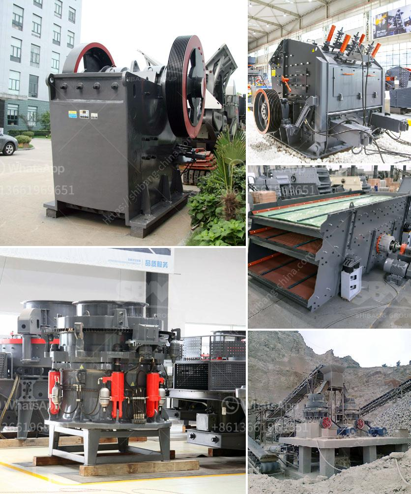

<h3>double roller crusher supplier</h3>
Double roller crusher, also known as roll crusher or double roll crusher, is used to crush and grind various materials and ores in the mining industry, construction materials industry, metallurgical industry and chemical industry. It is efficient and energy-saving, and has a great crushing ratio and a uniform particle size.

The double roller crusher supplier currently sells more than 100 sets of equipment per year, with a total of thousands of equipment sold in the past decade or so. The double-roller crusher, also known as the roll crusher, often used as a secondary or tertiary crusher, is used to further reduce the size of the material after it has been crushed by a single-roller crusher.

The double-roller crusher has a simple structure and is easy to operate. It can achieve the ideal crushing granularity by adjusting the gap of the crushing roller, which is easy to maintain. It has the characteristics of low noise, less dust and low power consumption. The double-roller crusher is suitable for medium and fine crushing of solid materials with a compressive strength of less than 120MPa, such as coal, coke, petroleum coke, limestone, sulfur ore, phosphate rock and other materials.

The double roller crusher supplier guarantees that the equipment is 100% brand new and meets the quality standards. The service life of the equipment is increased by 50%, and the maintenance and overhaul frequency is reduced. The production can be increased by 40%, and the power consumption per unit product can be reduced by 30%. It has been widely used in many industries such as mining, chemical industry, metallurgy and coal.

The double roller crusher supplier is certified by ISO9001:2000 international quality system standard, and has established a strict quality assurance system. A set of scientific management system, production technology and strict quality inspection procedures have been implemented to ensure the good quality of the equipment and the reliable performance.

In addition to the double roller crusher, the supplier can also provide other crushers and equipment, such as tire mobile jaw crusher, tire mobile cone crusher, tire mobile impact crusher, etc., which greatly expands the scope of application of crushed stone. Users can choose the crusher according to their own needs.

As a reliable double roller crusher supplier, we are committed to providing customers with high-quality equipment, favorable prices, and thoughtful after-sales service. We have a professional technical team to provide you with one-stop service to meet your needs. Our after-sales service includes installation guidance, regular inspection of equipment, maintenance and repair, and replacement of vulnerable parts.

In summary, the double roller crusher is suitable for crushing various materials with medium or high hardness. It is a reliable and efficient crushing equipment, which is widely used in mining, construction materials, metallurgy, chemical industry and other industries. As a trustworthy double roller crusher supplier, we provide customers with high-quality equipment, competitive prices and timely and thoughtful service.
<h3>Contact us</h3><ul><li><strong>Whatsapp:&nbsp;<a href="https://wa.me/8613661969651">+8613661969651</a></strong></li><li><a href="https://swt.shibang-china.com/?git&amp;zhl&amp;double roller crusher supplier"><strong>Online Service(chat now)</strong></a></li></ul><h3>Related</h3><ul><li><a href='roller mill for ares.md'>roller mill for ares</a></li><li><a href='crusher for sale in pakistan.md'>crusher for sale in pakistan</a></li><li><a href='portable stone crusher and prices.md'>portable stone crusher and prices</a></li><li><a href='stone crusher for hire in durban.md'>stone crusher for hire in durban</a></li><li><a href='ball mills for sale south africa.md'>ball mills for sale south africa</a></li></ul>