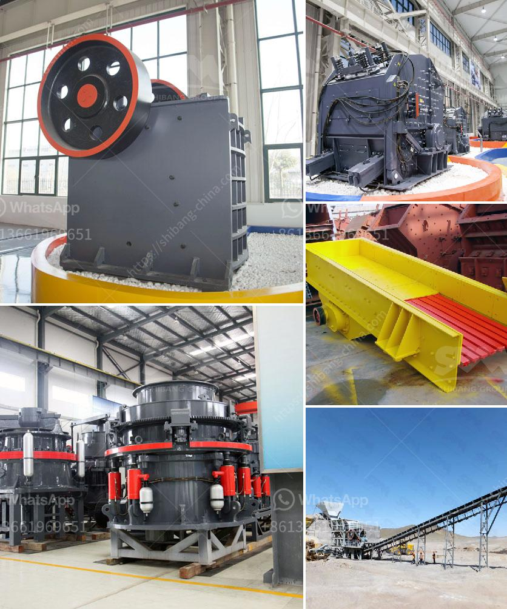

<h3>dry calcium carbonate 3 5 micron production</h3>
Dry calcium carbonate, with a particle size of 3-5 microns, is a widely used industrial product. This fine powder is produced through a meticulous process that ensures its purity and quality. Calcium carbonate, a compound composed of calcium, carbon, and oxygen, is derived from limestone, marble, or chalk.

The production of dry calcium carbonate involves several stages. Initially, the raw materials, such as limestone, are carefully selected and crushed into smaller pieces. These pieces are further ground in specialized mills to achieve the desired particle size range. The grinding process is crucial as it determines the fineness of the final product.

Once the grinding process is complete, the calcium carbonate powder is meticulously sifted and separated based on its particle size. This helps in removing any unwanted larger particles, ensuring uniformity. After separation, the powder is then dried using advanced drying techniques, removing any moisture content and resulting in a dry product.

Dry calcium carbonate has various industrial applications. One of its primary uses is in the paper industry, where it is used as a coating and filler material. The fine particle size of 3-5 microns provides a smooth and uniform surface finish, improving the printability and appearance of paper. Furthermore, it enhances the paper's brightness, opacity, and whiteness.

In addition to the paper industry, dry calcium carbonate is used in the production of paints, coatings, plastics, and rubber. Its small particle size ensures excellent dispersion, enabling the powder to be easily incorporated into these materials. The addition of dry calcium carbonate improves the performance of these products, such as enhancing gloss, enhancing color retention, increasing opacity, and improving durability.

Dry calcium carbonate, with a particle size of 3-5 microns, is also utilized in the environmental sector. It is commonly used in water and wastewater treatment processes. The fine particles act as a coagulant, facilitating the removal of impurities and suspended solids from the water. It also helps to adjust the acidity and pH levels of water, making it suitable for various applications.

In conclusion, the production of dry calcium carbonate with a particle size of 3-5 microns involves a careful grinding and drying process. This fine powder finds wide-ranging applications across industries such as paper, coatings, plastics, rubber, and water treatment. Its uniform particle size and high purity contribute to its usefulness and versatility, making it an essential ingredient in various industrial processes.
<h3>Contact us</h3><ul><li><strong>Whatsapp:&nbsp;<a href="https://wa.me/8613661969651">+8613661969651</a></strong></li><li><a href="https://swt.shibang-china.com/?git&amp;zhl&amp;dry calcium carbonate 3 5 micron production"><strong>Online Service(chat now)</strong></a></li></ul><h3>Related</h3><ul><li><a href='quartz crushing machine price.md'>quartz crushing machine price</a></li><li><a href='prices of stone crusher.md'>prices of stone crusher</a></li><li><a href='jaw crusher altairac.md'>jaw crusher altairac</a></li><li><a href='ball mill problems in copper plant.md'>ball mill problems in copper plant</a></li><li><a href='coal crusher machine 5 ton per hours.md'>coal crusher machine 5 ton per hours</a></li></ul>