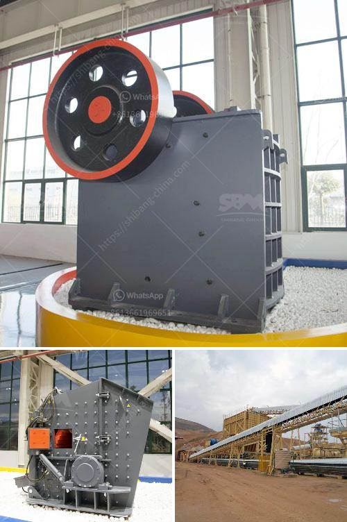

<h3>dry iron ore processing methods</h3>
Dry processing is associated with the quality of iron ore extracted from mines. In recent years, the dry processing technique has gained significant attention due to its advantages over traditional methods of iron ore extraction. It's been proven to be a cost-effective and efficient method compared to wet processing.

One of the major advantages of dry processing is the flexibility it offers in controlling the quality of the final product. Various techniques are employed to ensure the desired grade and specifications are achieved. The dry screening technique ensures the particle size is uniform for efficient melting in the blast furnace. This method eliminates the need for water in the crushing and washing process, saving vast amounts of water.

Another significant advantage is the reduced environmental impact associated with dry processing. Traditional methods involve large quantities of water, which can create mining waste and potential water pollution. With dry processing, there is a reduced risk of water pollution and lower energy consumption, leading to a greener and more sustainable approach to iron ore extraction.

Dry processing techniques can also generate a superior product compared to wet methods. The increased purity of the final iron ore products can be achieved using advanced separation technologies, including magnetic separation and flotation. Advanced techniques ensure the high quality and purity of the final product, which is essential for meeting strict market demands.

Furthermore, dry processing methods allow for the recovery of valuable materials from previously discarded iron ore tailings. This not only maximizes the utilization of resources but also reduces the overall environmental footprint of the mining operation.

In conclusion, dry iron ore processing methods offer a cost-effective and environmentally friendly solution to the extraction of high-quality iron ore. These methods can eliminate the need for water and save energy, potentially revolutionizing the iron ore mining industry in the future. With continued advancements in technology, dry processing may become the norm for extracting iron ore from mines worldwide.
<h3>Contact us</h3><ul><li><strong>Whatsapp:&nbsp;<a href="https://wa.me/8613661969651">+8613661969651</a></strong></li><li><a href="https://swt.shibang-china.com/?git&amp;zhl&amp;dry iron ore processing methods"><strong>Online Service(chat now)</strong></a></li></ul><h3>Related</h3><ul><li><a href='jaw crushers sale.md'>jaw crushers sale</a></li><li><a href='stone crusher design.md'>stone crusher design</a></li><li><a href='sand conveyors for rent.md'>sand conveyors for rent</a></li><li><a href='ball mill manufacturer in india.md'>ball mill manufacturer in india</a></li><li><a href='aluminum slag processing plant in germany.md'>aluminum slag processing plant in germany</a></li></ul>