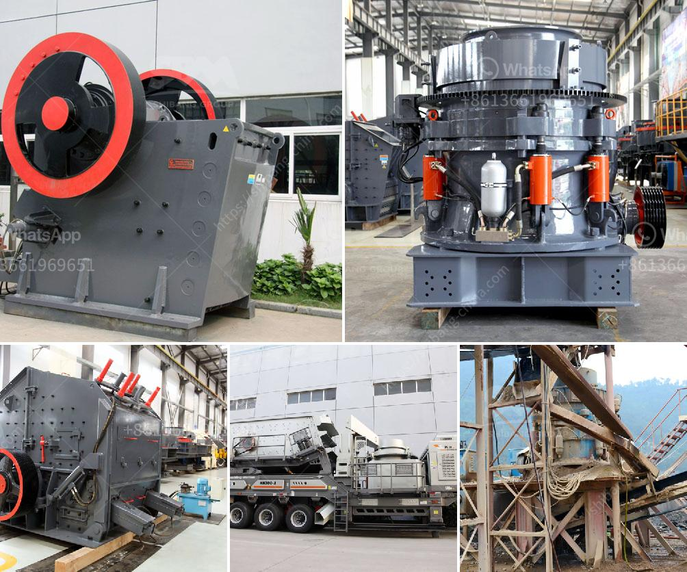

<h3>dry process of manufacturing calcium phosphate</h3>
Calcium phosphate, a compound of calcium and phosphorus, is an essential mineral found in the human body. It is primarily known for its role in maintaining strong and healthy bones and teeth. However, calcium phosphate also plays a significant role in various industrial applications, such as food and beverage production, pharmaceutical manufacturing, and fertilizer production.

One of the common methods of manufacturing calcium phosphate is through a dry process. The dry process involves the reaction between calcium oxide (lime) and phosphoric acid, resulting in the production of calcium phosphate. Let's delve deeper into the dry process of manufacturing calcium phosphate.

The first step in the dry process is the preparation of calcium oxide, commonly known as quicklime. Quicklime is obtained by heating limestone or chalk at extremely high temperatures, typically ranging from 900 to 1200 degrees Celsius. This intense thermal treatment causes limestone to undergo a chemical change, resulting in the production of calcium oxide. The calcium oxide is then crushed into a fine powder, ready for the next stage of the process.

The second step involves the preparation of phosphoric acid. Phosphoric acid can be obtained through various methods, including the reaction between phosphate rock and sulfuric acid. This reaction results in the production of phosphoric acid, which is a crucial component for the next stage of the manufacturing process.

In the third step, the calcium oxide is mixed with phosphoric acid to initiate the reaction, which ultimately leads to the formation of calcium phosphate. This mixing process can be conducted using various equipment, such as blenders or mixers, to ensure a thorough and uniform mixture.

During the reaction, calcium oxide reacts with phosphoric acid to form calcium phosphate. The reaction between calcium oxide and phosphoric acid is exothermic, meaning that it releases heat energy. This heat is used to drive off any excess moisture present in the mixture, resulting in the formation of a dry product.

Once the reaction is complete, the mixture is left to cool down. The cooled mixture is then further processed to obtain the desired form of calcium phosphate. This may involve additional steps such as grinding, sieving, or drying to achieve the desired particle size and moisture content.

The final step in the manufacturing process involves packaging and storage. The calcium phosphate is carefully packaged in suitable containers to ensure its quality and prevent any contamination. It is then stored in a controlled environment to preserve its chemical properties.

The dry process of manufacturing calcium phosphate offers several advantages. Firstly, it is a cost-effective method as it eliminates the need for large quantities of water, which is typically required in wet processes. Additionally, the dry process allows for better control of the reaction, resulting in a more consistent and uniform product. Furthermore, the dry process reduces the overall production time, making it a more efficient method.

In conclusion, the dry process of manufacturing calcium phosphate involves the reaction between calcium oxide and phosphoric acid, resulting in the production of this essential mineral compound. This process offers several advantages, including cost-effectiveness, better control of the reaction, and reduced production time. Calcium phosphate produced through the dry process serves various industrial applications and plays a vital role in the overall well-being of living organisms.
<h3>Contact us</h3><ul><li><strong>Whatsapp:&nbsp;<a href="https://wa.me/8613661969651">+8613661969651</a></strong></li><li><a href="https://swt.shibang-china.com/?git&amp;zhl&amp;dry process of manufacturing calcium phosphate"><strong>Online Service(chat now)</strong></a></li></ul><h3>Related</h3><ul><li><a href='gravimetric centrifugal gold concentrator.md'>gravimetric centrifugal gold concentrator</a></li><li><a href='how to build a gold washing plant.md'>how to build a gold washing plant</a></li><li><a href='gold processing methods iron slag.md'>gold processing methods iron slag</a></li><li><a href='crushers stone crushers price.md'>crushers stone crushers price</a></li><li><a href='raymond mill and high pressure difference.md'>raymond mill and high pressure difference</a></li></ul>