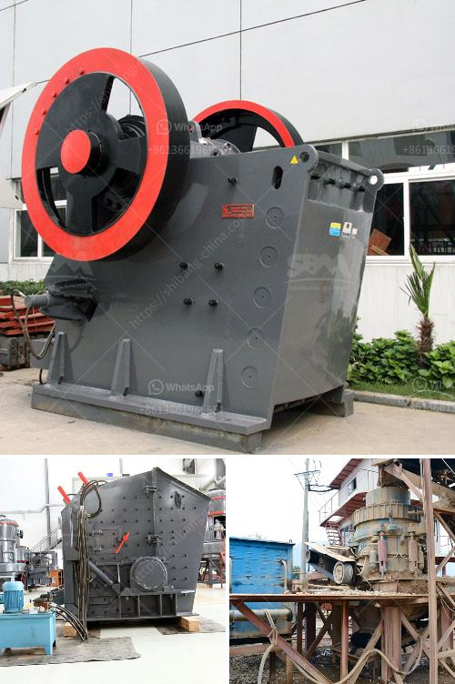

<h3>dust cover for screening and crushing plant</h3>
In any industrial process, it is essential to minimize the release of pollutants to the environment. This principle applies to crushing and screening plants, where large rocks are extracted, crushed, and screened into different sizes for various applications. However, these processes can generate an abundance of dust particles, which pose a significant health and environmental risk. To mitigate these hazards, a dust cover is necessary to control and reduce dust emissions from screening and crushing plants.

Dust emission from crushing and screening plants occurs during various stages of the process. Firstly, rocks are extracted from the earth's crust and transported to the crushing and screening plants. During the initial crushing process, large rocks are reduced into smaller ones, which release substantial amounts of dust into the air. Additionally, during the screening process, fine particles are separated from coarse ones, and this separation can also generate dust. As a result, without proper measures, dust particles can disperse through the atmosphere, affecting nearby communities, workers, and the overall environment.

Implementing a dust cover for screening and crushing plants is an effective strategy to control and reduce dust emissions. This cover acts as a physical barrier between the dust-generating process and the surroundings. By enclosing crushing and screening equipment, the dust cover ensures that the majority of dust particles remain confined within the enclosure. Consequently, fewer particles are released into the air, significantly reducing the potential harm to human health and the environment.

A well-designed and properly installed dust cover provides several benefits for screening and crushing plants. Firstly, it protects workers from harmful dust exposure, minimizing the risk of respiratory diseases and other related health issues. By reducing the ambient dust levels, the overall air quality within the facility is improved, creating a healthier and safer working environment for operators and maintenance personnel.

Furthermore, a dust cover contributes to environmental protection by containing dust emissions within the plant premises. This prevents the dispersion of dust particles into the air, soil, and water bodies. Consequently, nearby communities and ecosystems are safeguarded from the negative impacts of dust pollution. Additionally, by implementing an effective dust control measure, companies demonstrate their commitment to sustainable and responsible operations, enhancing their reputation within the industry and among stakeholders.

Designing an efficient dust cover for screening and crushing plants requires careful consideration of various factors. The cover should be constructed from durable materials that can withstand the mining and crushing environment, ensuring long-term performance with minimal maintenance needs. It should also incorporate proper air filtration systems to capture and trap dust particles efficiently. Additionally, the cover should be designed to allow easy access for maintenance and repair activities, ensuring the smooth operation of the equipment within the enclosure.

In conclusion, a dust cover is an indispensable element for screening and crushing plants to control and reduce dust emissions. By enclosing the equipment and containing the dust-generating process, the cover minimizes both human health risks and environmental damage. Implementing a well-designed and properly installed dust cover demonstrates a commitment to sustainable practices and sets a benchmark for responsible operation within the industry. Thus, investing in a dust cover for screening and crushing plants is a crucial step towards efficient and environmentally friendly aggregate production.
<h3>Contact us</h3><ul><li><strong>Whatsapp:&nbsp;<a href="https://wa.me/8613661969651">+8613661969651</a></strong></li><li><a href="https://swt.shibang-china.com/?git&amp;zhl&amp;dust cover for screening and crushing plant"><strong>Online Service(chat now)</strong></a></li></ul><h3>Related</h3><ul><li><a href='used crusher for sale in dubai.md'>used crusher for sale in dubai</a></li><li><a href='crusher plant power screen.md'>crusher plant power screen</a></li><li><a href='second hand stone crusher sale in india.md'>second hand stone crusher sale in india</a></li><li><a href='iron ore mines equipments.md'>iron ore mines equipments</a></li><li><a href='used sweco screening equipment for sale.md'>used sweco screening equipment for sale</a></li></ul>