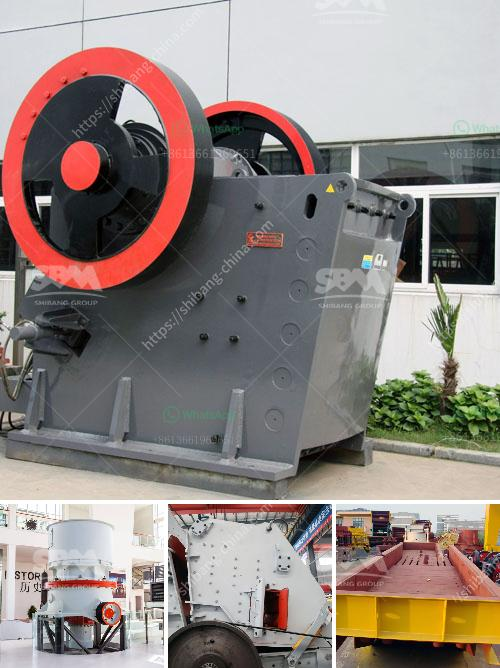

<h3>equipment for gold refinery</h3>
The gold refining process is a delicate and intricate procedure that requires utmost care and precision. To carry out this procedure successfully, reliable and high-quality equipment is essential. In a gold refinery, various equipment is used to extract and refine gold from raw materials such as ore, jewelry, electronic waste, and dental scraps. This article will discuss the crucial equipment used in a gold refinery and highlight their importance in ensuring a smooth and efficient gold extraction process.

One of the primary pieces of equipment in a gold refinery is the gold melting furnace. This furnace is specifically designed to melt gold and bring it to its molten form by subjecting it to high temperatures. These furnaces are available in various sizes and types, including induction furnaces, electric arc furnaces, and gas-fired furnaces. Induction furnaces are the most commonly used in gold refineries due to their ability to provide precise temperature control and high energy efficiency.

Once the gold is melted, the next vital equipment in the gold refining process is the gold refining machine. This machine plays a crucial role in purifying the molten gold by removing impurities and separating it from other metals. The refining machine utilizes various methods such as electrolysis, chemical treatment, and filtration techniques to achieve a high level of purity, typically 99.99% or higher. Some advanced gold refining machines also employ advanced technologies like vacuum distillation to further enhance the quality of the refined gold.

Another essential piece of equipment in a gold refinery is the gold electroplating cell. This cell is used to deposit a layer of pure gold onto other metals, creating gold-plated products. The process involves passing an electric current through a gold electrolyte solution, resulting in the transfer of gold ions onto the surface of the metal being plated. Gold electroplating cells come in different sizes and designs to accommodate various types of objects, ranging from small jewelry pieces to large industrial components.

To handle and transport gold during the refining process, gold refinery equipment also includes precision weighing scales and safe storage solutions. Accurate weighing scales are used to measure the weight of gold and other precious metals. These scales are highly sensitive and calibrated to provide precise measurements, ensuring accurate assessment of the value of the gold being processed. Safe storage solutions are critical to protect the refined gold and prevent any potential loss or contamination. Secure vaults or safes with controlled access are often used to safeguard the refined gold until it is ready for distribution or sale.

In conclusion, equipment plays a vital role in the gold refinery process, ensuring efficient and precise gold extraction. From melting furnaces and refining machines to electroplating cells and weighing scales, each piece of equipment has its unique function in the gold refinery workflow. Investing in high-quality and reliable equipment is essential for gold refineries to maintain the integrity of the refining process and produce refined gold of the highest quality. Ultimately, the right equipment contributes to the success of a gold refinery by enabling the extraction of pure gold from various raw materials and ensuring its transformation into valuable products that meet the industry's stringent standards.
<h3>Contact us</h3><ul><li><strong>Whatsapp:&nbsp;<a href="https://wa.me/8613661969651">+8613661969651</a></strong></li><li><a href="https://swt.shibang-china.com/?git&amp;zhl&amp;equipment for gold refinery"><strong>Online Service(chat now)</strong></a></li></ul><h3>Related</h3><ul><li><a href='list mining equipments are used in granite quarries.md'>list mining equipments are used in granite quarries</a></li><li><a href='used concrete mixer for sale dubai.md'>used concrete mixer for sale dubai</a></li><li><a href='plant making bricks from marble.md'>plant making bricks from marble</a></li><li><a href='crushing efficiency of ball mill.md'>crushing efficiency of ball mill</a></li><li><a href='crusher equipment manufacturer.md'>crusher equipment manufacturer</a></li></ul>