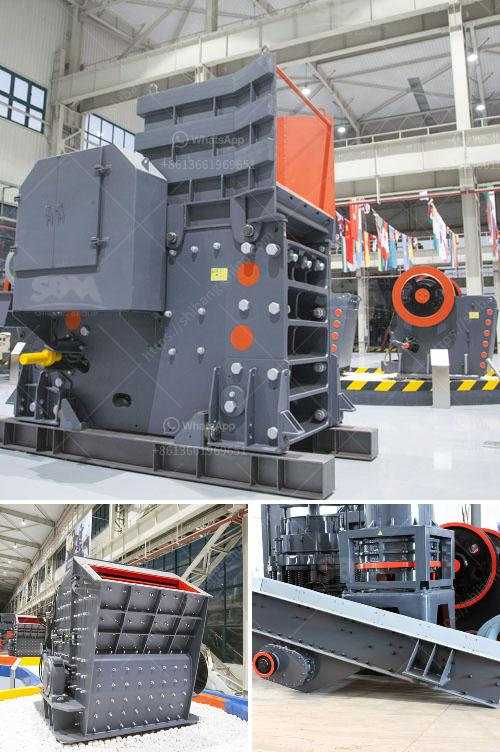

<h3>equipment for grinding calcium carbonate</h3>
Grinding calcium carbonate is a necessary process in various industrial sectors. However, due to its low hardness, calcium carbonate is usually processed by a milling machine to obtain powders with a certain particle size, and then processed by a calcium carbonate grinding mill for grinding and shaping. With the continuous development of technology and the continuous improvement of equipment performance, the equipment for grinding calcium carbonate has become more advanced and efficient. In this article, we will introduce some common equipment for grinding calcium carbonate.

Raymond mill is a commonly used equipment for grinding calcium carbonate. It has a wide range of application and high cost performance. It can be used for grinding gypsum, talc, calcite, limestone, marble, barite, dolomite, fluorite, kaolin, cement and other materials with Mohs hardness less than 9.3 and humidity less than 6%. The finished product has a particle size of 80-325 mesh.

Raymond mill has the advantages of small floor area, strong system completeness, simple operation and reliable performance. Its grinding roller and grinding ring are made of special materials, and the materials have a longer service life. The whole machine is equipped with a pulse dust collector, which can achieve efficient dust removal and meet environmental protection requirements.

Ball mill is a commonly used equipment for grinding calcium carbonate. It has a wide range of applications and can be used for grinding various ores and other grindable materials. It is widely used in mineral processing, building materials, and chemical industries.

The ball mill has a simple structure, low operating cost, and high grinding efficiency. It can realize continuous production and is favored by large and medium-sized calcium carbonate grinding plants. The grinding media of the ball mill are generally steel balls, which have a large crushing force and can grind the calcium carbonate particles to the required fineness.

Vertical roller mill is a high-efficiency equipment for grinding calcium carbonate. It is mainly used for grinding raw materials, such as limestone, calcite, marble, barite, dolomite, etc. It can also be used for grinding materials, cement, and metallurgy industries.

Vertical roller mill has the characteristics of large production capacity, low energy consumption, and high grinding efficiency. It adopts new technologies such as wear-resistant materials and multi-head powder selection, which greatly improves the grinding efficiency and output of calcium carbonate.

In conclusion, the equipment for grinding calcium carbonate has advanced and efficient options such as Raymond mill, ball mill, and vertical roller mill. Different equipment has different advantages and can meet the grinding requirements of different fineness and production capacity. When choosing the equipment, it is necessary to consider factors such as cost, production requirements, and environmental protection. Through continuous technological innovation and improvement, the equipment for grinding calcium carbonate will continue to become more advanced and efficient, promoting the development of related industries.
<h3>Contact us</h3><ul><li><strong>Whatsapp:&nbsp;<a href="https://wa.me/8613661969651">+8613661969651</a></strong></li><li><a href="https://swt.shibang-china.com/?git&amp;zhl&amp;equipment for grinding calcium carbonate"><strong>Online Service(chat now)</strong></a></li></ul><h3>Related</h3><ul><li><a href='busines project proposal for stone crusher.md'>busines project proposal for stone crusher</a></li><li><a href='methods of hammer mill.md'>methods of hammer mill</a></li><li><a href='jaw crusher for sale in usa.md'>jaw crusher for sale in usa</a></li><li><a href='small scale crushing plant.md'>small scale crushing plant</a></li><li><a href='iron crushing plant.md'>iron crushing plant</a></li></ul>