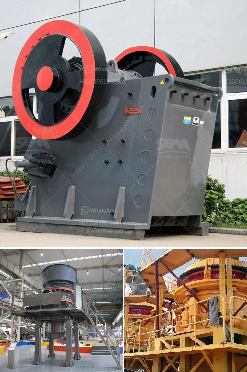

<h3>equipment for mineral ore mining industry</h3>
The mineral ore mining industry plays a significant role in the global economy. It supplies raw materials essential for various industries, such as construction, manufacturing, and energy production. To efficiently extract these valuable resources, the industry heavily relies on advanced equipment specifically designed for mining operations. This article will provide a comprehensive overview of the various equipment used in mineral ore mining and how they contribute to successful mining endeavors.

One of the primary pieces of equipment found in mineral ore mining is the drilling rig. These massive machines are responsible for creating holes or wells in the ground to extract the minerals. Depending on the mining site's geology and mining method, different types of drilling rigs are used. Some common drilling rigs include rotary drills, blasthole drills, and underground drilling equipment. These rigs are equipped with robust drilling tools to penetrate hard rock surfaces, allowing access to the minerals below.

For efficient extraction of mineral ores from the ground, loaders and excavators are crucial equipment. Loaders are used to scoop up and transport the ore from mining faces to trucks or conveyor belts for further processing. Excavators, on the other hand, are employed to dig up the ore from open-pit mines. These heavy machines have high lifting capacities and are efficient in large-scale mining operations. Excavators equipped with hydraulic hammers are also used for breaking up large rocks or removing obstacles.

Once the ore is extracted, it goes through a series of processing steps to separate the valuable minerals from the waste material. Crushers and screens play a pivotal role in this process. Crushers are machines designed to reduce large rocks into smaller, more manageable sizes. They crush the crude ore to a consistent size and prepare it for further processing. Screens are used to separate the crushed ore into different sizes, allowing the mineral processing plant to treat each size fraction accordingly.

Conveyors are integral equipment for the mineral ore mining industry. They transport the mined ores from one stage of the mining process to another. Conveyors are critical for uninterrupted material flow and are capable of handling large volumes of ore. They can be configured to transport material horizontally, vertically, or even around corners, making them highly versatile in mining operations.

In underground mining, specialized equipment is used to ensure safe and efficient operations. Longwall mining and continuous miners are commonly employed in underground coal mining. Longwall mining uses a shearing machine to extract coal along the face of the coal seam, allowing for higher production rates. Continuous miners are used to cut coal from the mining face continuously, with the mined material transported directly onto conveyor belts.

The mineral ore mining industry relies heavily on robust equipment to extract and process valuable resources efficiently. Drilling rigs, loaders, excavators, crushers, screens, and conveyors are just some of the essential equipment utilized in this industry. These machines enable mining companies to extract minerals from the ground economically and in large quantities. As technology continues to advance, the equipment used in mineral ore mining will become even more sophisticated, enabling increased productivity and safer operations.
<h3>Contact us</h3><ul><li><strong>Whatsapp:&nbsp;<a href="https://wa.me/8613661969651">+8613661969651</a></strong></li><li><a href="https://swt.shibang-china.com/?git&amp;zhl&amp;equipment for mineral ore mining industry"><strong>Online Service(chat now)</strong></a></li></ul><h3>Related</h3><ul><li><a href='mobile chrome ore plant.md'>mobile chrome ore plant</a></li><li><a href='washing plant supplier in mozambique.md'>washing plant supplier in mozambique</a></li><li><a href='ceramic crushing production line.md'>ceramic crushing production line</a></li><li><a href='roller crusher cad detail drawing.md'>roller crusher cad detail drawing</a></li><li><a href='list of mineral processing plants in oman.md'>list of mineral processing plants in oman</a></li></ul>