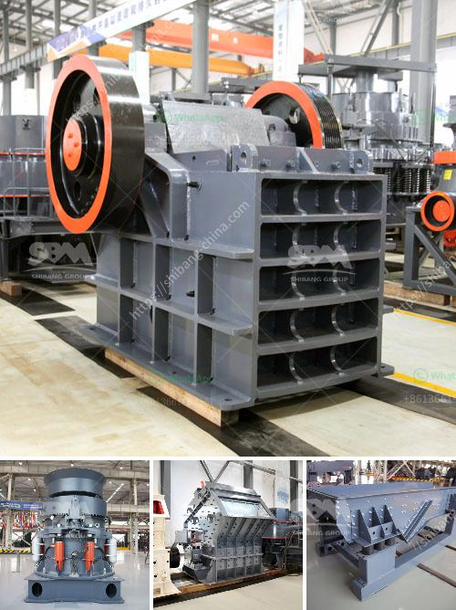

<h3>equipment of gold mining</h3>
The gold mining industry has always been a key contributor to the global economy. While this precious metal has been mined for centuries, modern-day gold mining processes are more efficient than ever. Gone are the days where gold prospectors would manually sift riverbeds or use crude tools to extract gold nuggets. Instead, advanced equipment is now utilized to ensure every ounce of gold is extracted from the earth.

One of the most crucial pieces of equipment in the gold mining industry is a professional-grade dredge. These powerful machines are specifically designed to extract larger quantities of gold from riverbeds and streambeds. Dredges work by using a suction system to vacuum up sediments and gravel that contain gold particles. This material is then processed to extract the gold, leaving behind any other unwanted sediments.

Modern dredges are equipped with state-of-the-art technology that improves efficiency and reduces environmental impact. Some of these advancements include GPS navigation systems, which allow operators to accurately target gold-bearing areas, and automatic monitoring sensors, which help prevent over-mining and provide real-time feedback on the amount of gold being extracted.

Another essential piece of machinery used in gold mining is the trommel. This rotating cylindrical screen separates larger rocks and debris from the gold-bearing ore, ensuring efficient and effective extraction. Trommels can be operated on land or in water bodies, depending on the location and type of deposit being mined. They come in various sizes and capacities, making them versatile and adaptable for different mining operations.

To extract gold from the ore, various processing methods are employed, with one of the most common being the use of cyanide. Gold mining companies use specialized equipment to mix cyanide solution with crushed ore particles, creating a slurry. This mixture is then pumped into large tanks where the gold particles bond with the cyanide to create a soluble compound known as gold cyanide. This solution is then treated further to separate the gold from other elements before being refined into pure gold.

In recent years, there has been a push towards more environmentally friendly gold mining practices. This has led to the development of innovative equipment, such as the gravity concentrator. This device uses centrifugal force to separate gold from other minerals, without the use of harmful chemicals like cyanide. By reducing the environmental impact, gravity concentrators have become a popular choice for small-scale gold miners.

The importance of efficient and reliable equipment in gold mining cannot be overstated. Not only does it increase productivity and profitability, but it also ensures the responsible extraction of this valuable natural resource. From dredges to trommels, each piece of equipment plays a vital role in the gold mining process.

As technology continues to advance, we can expect further improvements in gold mining equipment. Innovations like automated sorting systems and remote monitoring capabilities promise to revolutionize the industry, increasing efficiency and reducing environmental impact even further. With these advancements, the future of gold mining looks brighter than ever, as it continues to contribute to global economies and provide a livelihood for many.
<h3>Contact us</h3><ul><li><strong>Whatsapp:&nbsp;<a href="https://wa.me/8613661969651">+8613661969651</a></strong></li><li><a href="https://swt.shibang-china.com/?git&amp;zhl&amp;equipment of gold mining"><strong>Online Service(chat now)</strong></a></li></ul><h3>Related</h3><ul><li><a href='stone crusher supplier company.md'>stone crusher supplier company</a></li><li><a href='lum vertical mill.md'>lum vertical mill</a></li><li><a href='sample quarry business plan.md'>sample quarry business plan</a></li><li><a href='calcium carbonate process flow diagram.md'>calcium carbonate process flow diagram</a></li><li><a href='bauxite crusher design.md'>bauxite crusher design</a></li></ul>