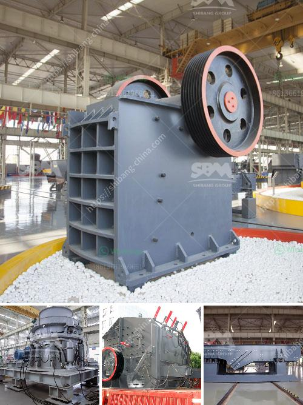

<h3>equipment required for alluvial gold mining</h3>
Alluvial gold mining is an incredibly efficient and popular method of extracting gold from river beds and other alluvial deposits. This type of mining produces gold that is remarkably pure and beautiful, making it a highly desired commodity for jewelry manufacturers and the general public alike. To successfully harvest alluvial gold, miners must utilize specific equipment that is designed to separate the gold from the surrounding sediment. Here, we will discuss the essential equipment required for alluvial gold mining.

Excavators are heavy machinery used to remove large amounts of sediment and rocks from the earth. They are crucial in alluvial gold mining as they are capable of digging deep into the ground, allowing miners to reach the alluvial deposits beneath the surface.

Trommels, also known as rotary screens, are cylindrical sieves that are used to separate materials. In alluvial gold mining, trommels are utilized to separate the smaller particles of gold from the larger sediment. This equipment is ideal for efficient processing of alluvial gold, as it greatly reduces the need for manual sifting and sorting.

Sluice boxes are long, narrow boxes that are positioned at an incline. Alluvial gold-bearing material is fed into the box, and water is introduced to wash away the lighter sediment. The heavier gold particles settle to the bottom of the box due to their density, creating a concentrated bed of gold that can be easily collected. Sluice boxes are a critical component of alluvial gold mining, as they offer high gold recovery rates and are relatively low-cost.

Dredges are specialized machines used to extract alluvial deposits from bodies of water. These machines are equipped with powerful suction hoses and are capable of extracting large quantities of sediment from riverbeds and riverbanks. Dredges play a crucial role in alluvial gold mining, particularly in areas where the gold deposits are submerged underwater.

Concentrators are machines used to separate and concentrate the gold particles from the sediment. They utilize gravity and centrifugal force to separate the gold from the surrounding materials. Concentrators are an essential piece of equipment for alluvial gold mining, as they enable miners to process large quantities of material quickly and efficiently.

Water pumps are used to create a continuous flow of water in alluvial gold mining operations, whether it is for washing material or operating sluice boxes. High-pressure water pumps are particularly beneficial, as they enable miners to process larger volumes of material and increase gold recovery rates.

In conclusion, alluvial gold mining requires specific equipment to effectively extract gold from river beds and other alluvial deposits. Excavators, trommels, sluice boxes, dredges, concentrators, and water pumps are all vital tools for successful alluvial gold mining operations. This equipment not only increases gold recovery rates but also enhances the safety and efficiency of the mining process. Alluvial gold mining continues to be a highly sought-after industry due to the quality and purity of the gold produced, making the investment in appropriate equipment well worth it.
<h3>Contact us</h3><ul><li><strong>Whatsapp:&nbsp;<a href="https://wa.me/8613661969651">+8613661969651</a></strong></li><li><a href="https://swt.shibang-china.com/?git&amp;zhl&amp;equipment required for alluvial gold mining"><strong>Online Service(chat now)</strong></a></li></ul><h3>Related</h3><ul><li><a href='equipment of gold mining.md'>equipment of gold mining</a></li><li><a href='cost of converyer belts in south africa.md'>cost of converyer belts in south africa</a></li><li><a href='crusher equipment manufacturer.md'>crusher equipment manufacturer</a></li><li><a href='small stone crusher machine.md'>small stone crusher machine</a></li><li><a href='quarry machine manfacturer.md'>quarry machine manfacturer</a></li></ul>