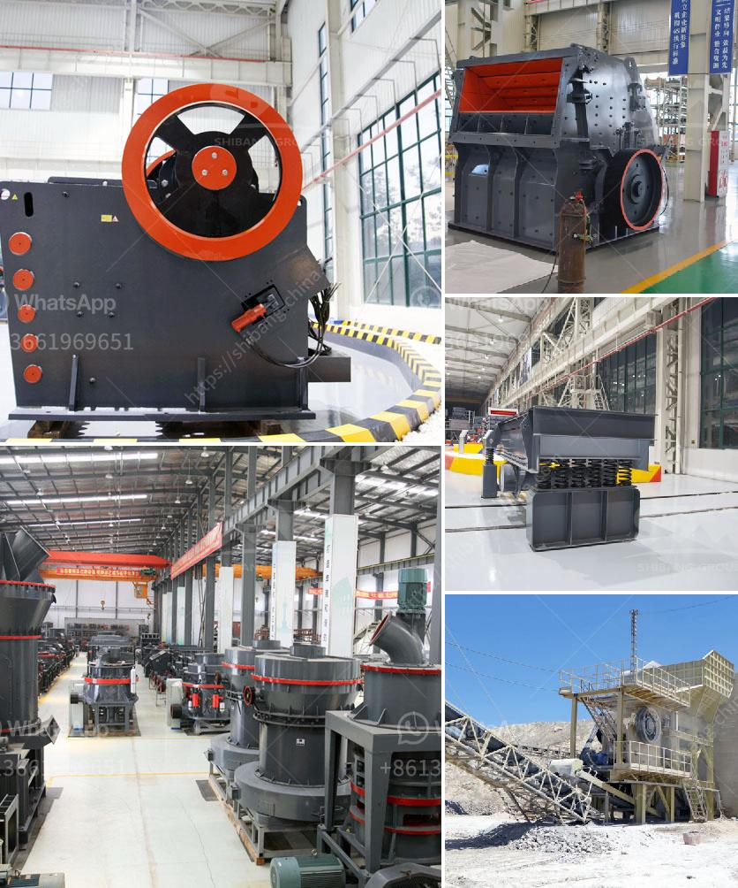

<h3>equipment used for crushing in activated carbon</h3>
Activated carbon is a highly porous substance that has a wide range of applications, from purifying water and air to various industrial processes. However, before it can be effectively utilized, it must go through a crucial stage known as crushing. This process involves breaking down the carbonaceous material into smaller particles to increase its surface area. To achieve this, several types of equipment are commonly used in the crushing stage of activated carbon production.

One of the most commonly used machines in the crushing process is the jaw crusher. Jaw crushers work by compressing the material between two opposing surfaces, known as jaws. As the material enters the crusher, it is crushed between the jaws, creating smaller particles suitable for further processing. Jaw crushers are known for their high efficiency and ability to handle tough and abrasive materials.

Another commonly used machine for crushing activated carbon is the impact crusher. This machine works by using a high-speed rotating rotor with a striking impact plate to crush the carbon material. The impact crusher is particularly useful for crushing hard and abrasive materials, producing a more uniform particle size distribution.

In addition to jaw and impact crushers, cone crushers are also used for activated carbon crushing. Cone crushers are designed to crush materials by squeezing them between a mantle and a concave surface. They are known for their efficiency, versatility, and ability to produce finely crushed particles.

To ensure efficient and effective crushing, it is important to choose the right equipment for the specific requirements of the activated carbon production process. Factors such as the type and size of the feed material, desired particle size distribution, and capacity requirements should all be considered when selecting equipment.

In conclusion, the crushing stage is a crucial step in the production of activated carbon. Various types of equipment, including jaw crushers, impact crushers, and cone crushers, are commonly used to break down the carbonaceous material into smaller particles. The choice of equipment depends on factors such as the material being processed and the desired particle size distribution. Selecting the right equipment is essential to ensure efficient and effective crushing during activated carbon production.
<h3>Contact us</h3><ul><li><strong>Whatsapp:&nbsp;<a href="https://wa.me/8613661969651">+8613661969651</a></strong></li><li><a href="https://swt.shibang-china.com/?git&amp;zhl&amp;equipment used for crushing in activated carbon"><strong>Online Service(chat now)</strong></a></li></ul><h3>Related</h3><ul><li><a href='ball mill size.md'>ball mill size</a></li><li><a href='limestone crushers for chicken feed production.md'>limestone crushers for chicken feed production</a></li><li><a href='feasibility study for gypsum powder production line.md'>feasibility study for gypsum powder production line</a></li><li><a href='dolomite powder making equipment.md'>dolomite powder making equipment</a></li><li><a href='granite crusher manufacturer.md'>granite crusher manufacturer</a></li></ul>