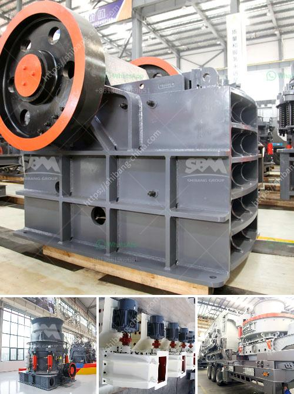

<h3>equipments used in coal mining</h3>
Equipment used in coal mining is complex and requires a wide range of specialized machinery and equipment to ensure efficient and safe coal extraction.

Coal mining equipment includes excavators, bulldozers, wheel loaders, underground mining equipment, and conveyors among others. These machines have a variety of different functions which enable miners to do their job efficiently and effectively.

Excavators are commonly used in coal mining operations to dig up soil and coal. These machines are giant in size and can scoop up large amounts of earth and coal in one go. They are equipped with powerful engines and hydraulic systems that enable them to move heavy loads. Excavators come in different sizes and designs, and they are used for different purposes in coal mining, such as digging trenches or removing overburden.

Bulldozers are another essential piece of equipment in coal mining. These machines are used to push large quantities of soil, rocks, and coal from the mining area. Bulldozers have thick blades mounted on the front that are used to clear the area and create a level surface for other machinery and vehicles to operate.

Wheel loaders are also commonly used in coal mining operations. These machines are equipped with a large bucket on the front that is used to scoop up and load materials such as coal into trucks or conveyors. Wheel loaders are versatile and can be used in different parts of the mining site to move materials or assist in other tasks.

Underground mining equipment is specialized equipment used for underground coal mining operations. This equipment includes continuous miners, shuttle cars, roof bolters, and miners' lamps. Continuous miners are machines with rotating drums that extract coal from the walls of the mine. Shuttle cars are used to transport coal from the mining area to the surface. Roof bolters are used to secure the roof of the mine, preventing cave-ins and ensuring the safety of the miners. Miners' lamps are essential safety equipment that provides illumination for miners in the dark and hazardous underground environment.

Conveyors are critical in coal mining operations as they transport coal from the mining area to the surface or other processing facilities. This equipment consists of a belt-driven system that enables the continuous movement of coal. Conveyors are used to improve the efficiency of coal transportation and reduce the need for manual labor in handling coal.

Overall, the equipment used in coal mining is essential in ensuring efficient and safe coal extraction. From excavators and bulldozers for earth and coal removal to underground mining equipment and conveyors for transportation, each machine plays a vital role in the coal mining process. The continuous advancement and development of these machines have greatly improved the productivity and safety of coal mining operations.
<h3>Contact us</h3><ul><li><strong>Whatsapp:&nbsp;<a href="https://wa.me/8613661969651">+8613661969651</a></strong></li><li><a href="https://swt.shibang-china.com/?git&amp;zhl&amp;equipments used in coal mining"><strong>Online Service(chat now)</strong></a></li></ul><h3>Related</h3><ul><li><a href='gold processing equipment.md'>gold processing equipment</a></li><li><a href='list of quarrying companies in the philippines.md'>list of quarrying companies in the philippines</a></li><li><a href='manufacture of conveyor belts in mexico.md'>manufacture of conveyor belts in mexico</a></li><li><a href='quartz powder special production line for mining.md'>quartz powder special production line for mining</a></li><li><a href='iron ore grinding ball mill.md'>iron ore grinding ball mill</a></li></ul>