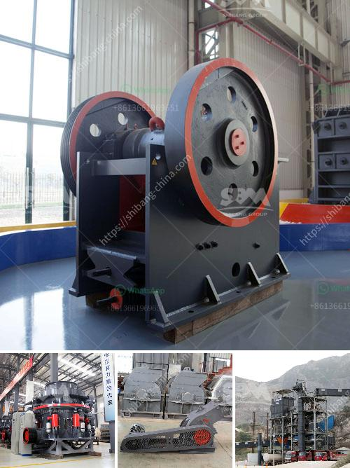

<h3>favrica of ball mills</h3>
Ball mills have been used for centuries in various industries and have become essential tools in the field of materials processing. These machines are often referred to as the workhorses of the industry, as they are capable of grinding and blending materials of different hardness and composition. But what makes ball mills so remarkable? Let's delve into the world of these fascinating machines.

The primary function of a ball mill is to reduce the size of materials into a fine powder. This reduction is achieved by the impact and attrition forces generated by the grinding media - usually spherical steel balls or ceramic balls. The material to be ground is loaded into the drum, which is then rotated along its axis. As the drum rotates, the grinding media cascade and tumble onto the material, crushing and grinding it into the desired particle size.

One of the key advantages of ball mills is their versatility. They can be used for both wet and dry grinding operations, making them suitable for a wide range of materials. Moreover, they can handle large quantities of material, thanks to their robust construction and large size. This makes ball mills ideal for grinding materials in industries such as mining, cement, and chemicals.

Another advantage of ball mills is their relatively low capital and operating costs. Compared to other grinding equipment, ball mills have a simple design and require minimal maintenance. This makes them a cost-effective solution, especially for processing large quantities of material. Additionally, ball mills can achieve very fine particle sizes, allowing for better control over product quality.

In recent years, ball mills have also been used in the field of mechanochemistry. Mechanochemical reactions refer to chemical reactions that are triggered by mechanical forces, such as grinding or milling. Ball mills provide a perfect platform for carrying out mechanochemical reactions, as they combine the required grinding forces with efficient mixing capabilities. This has opened up new possibilities for synthesizing and modifying materials for various applications, including pharmaceuticals and advanced materials.

It is worth mentioning that the development of ball mills has not stopped evolving. Modern ball mills often feature advanced technologies, such as variable speed drives, to optimize grinding performance and reduce energy consumption. Researchers are also exploring innovative grinding media materials, shape optimization, and new operating conditions to further improve the efficiency and effectiveness of ball mills.

In conclusion, ball mills are fascinating machines that play a vital role in materials processing. Their ability to grind and blend materials of various hardness and composition makes them indispensable in industries such as mining, cement, and chemicals. The versatility, cost-effectiveness, and potential for carrying out mechanochemical reactions make ball mills a key tool for researchers and engineers alike. As the field of materials processing continues to advance, so too will the capabilities and applications of ball mills.
<h3>Contact us</h3><ul><li><strong>Whatsapp:&nbsp;<a href="https://wa.me/8613661969651">+8613661969651</a></strong></li><li><a href="https://swt.shibang-china.com/?git&amp;zhl&amp;favrica of ball mills"><strong>Online Service(chat now)</strong></a></li></ul><h3>Related</h3><ul><li><a href='dolomite crusher manufacturing plant.md'>dolomite crusher manufacturing plant</a></li><li><a href='hydrated lime powder making machine from germany.md'>hydrated lime powder making machine from germany</a></li><li><a href='cost of vertical raw mill.md'>cost of vertical raw mill</a></li><li><a href='used stone crusher plant for sale in uk.md'>used stone crusher plant for sale in uk</a></li><li><a href='crusher equipment manufacturer.md'>crusher equipment manufacturer</a></li></ul>