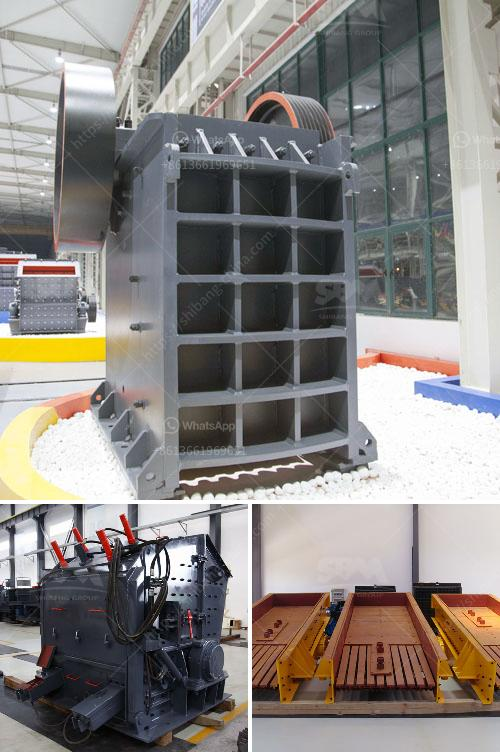

<h3>feasibility study for gypsum powder production line</h3>
Gypsum powder production line is a natural mineral which is obtained by grinding and calcining gypsum rock. It is used in the manufacturing of various construction materials such as drywall, plaster, plasterboards, and cement. However, the development of gypsum powder production line faces a number of challenges such as high investment costs, large production capacity requirements, and strict environmental regulations. Therefore, conducting a feasibility study is crucial to evaluate the potential success of this project.

The first step in conducting a feasibility study for gypsum powder production line is to identify the project's objectives and scope. This involves determining the target market, the expected production capacity, and the potential profitability. The target market should be analyzed in terms of demand for gypsum powder and its derivatives, such as drywall and plasterboards. It is important to assess potential competitors and their market share, as well as to identify any market trends or preferences that could impact the success of the project.

Next, the feasibility study should evaluate the availability and accessibility of the necessary resources for gypsum powder production. This includes assessing the availability of gypsum rock deposits, as well as transportation infrastructure for raw material delivery and finished product distribution. It is important to consider the cost and feasibility of sourcing gypsum rock locally versus importing it from other regions. In addition, the study should assess the availability and cost of other essential resources such as energy, water, and labor.

The feasibility study should also analyze the technical aspects of gypsum powder production line. This includes evaluating the required machinery and equipment, as well as their cost, capacity, and efficiency. It is important to select the most suitable technology and equipment for the project, considering factors such as production capacity, product quality, and energy consumption. The study should also evaluate the compatibility and integration of the production line with existing infrastructure or operations, and any required modifications or upgrades.

Furthermore, the feasibility study should include a thorough financial analysis of the project. This includes estimating the initial investment costs for the construction of the production line, as well as the operating expenses and cash flow projections. The study should assess the potential profitability of the project, taking into account factors such as pricing, production costs, market demand, and sales volume. It is important to evaluate the project's return on investment (ROI) and payback period to determine its feasibility.

Finally, the feasibility study should consider the environmental and socio-economic impacts of gypsum powder production line. This involves reviewing and complying with applicable environmental regulations and standards. It is important to assess the potential environmental risks and impacts associated with the project, and to develop mitigation measures to minimize them. The study should also consider the potential socio-economic benefits, such as job creation and local economic development, as well as any potential negative impacts on the community.

In conclusion, conducting a feasibility study for gypsum powder production line is essential to evaluate the viability of the project. The study should assess the market demand, availability of resources, technical aspects, financial feasibility, and environmental and socio-economic impacts of the project. By systematically analyzing these factors, decision-makers can make informed decisions and determine the potential success of gypsum powder production line.
<h3>Contact us</h3><ul><li><strong>Whatsapp:&nbsp;<a href="https://wa.me/8613661969651">+8613661969651</a></strong></li><li><a href="https://swt.shibang-china.com/?git&amp;zhl&amp;feasibility study for gypsum powder production line"><strong>Online Service(chat now)</strong></a></li></ul><h3>Related</h3><ul><li><a href='mining quarry equipment for sale sri lanka.md'>mining quarry equipment for sale sri lanka</a></li><li><a href='equipment for gold refinery.md'>equipment for gold refinery</a></li><li><a href='used equipment cement for sale vertical roller mills.md'>used equipment cement for sale vertical roller mills</a></li><li><a href='clinker making machine for sell germany.md'>clinker making machine for sell germany</a></li><li><a href='mining equipment for hire zimbabwe.md'>mining equipment for hire zimbabwe</a></li></ul>