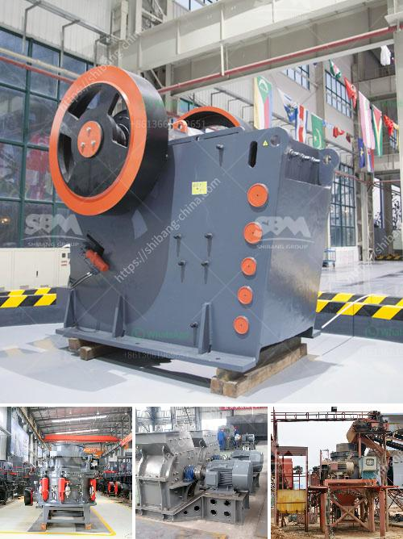

<h3>febcoal coal mining plant in ethiopia</h3>
Ethiopia, a fast-growing country in East Africa, has been focusing on developing its energy sector to meet the increasing demand for electricity. In line with this vision, the government has approved the establishment of the Febcoal coal mining plant, aimed at harnessing the significant coal reserves in the country. This article will explore the potential benefits and concerns associated with the project.

The Febcoal coal mining plant is a large-scale project that plans to exploit the extensive coal deposits located in the Oromia Regional State of Ethiopia. With an estimated capacity of extracting over 13 million tons of coal annually, the plant aims to contribute significantly to Ethiopia's energy generation capacity.

1. Energy Generation: One of the primary benefits of the Febcoal coal mining plant is the potential to increase Ethiopia's energy generation capacity. Coal, a reliable and affordable energy source, can play a critical role in diversifying the country's energy mix. This will reduce the dependency on hydroelectric power, which is susceptible to droughts and other climatic conditions.

2. Job Creation and Economic Growth: The Febcoal plant is expected to create a significant number of employment opportunities, particularly for the local communities living near the mining site. The project will require a diverse workforce, including engineers, technicians, and skilled labor, thus driving economic development and improving livelihoods.

3. Infrastructure Development: The establishment of the coal mining plant will pave the way for necessary infrastructure development in the vicinity. This includes the construction of roads, railways, and power transmission lines, which will not only facilitate coal transport but also benefit other sectors of the economy.

4. Increased Revenue: The development of the coal mining sector has the potential to generate substantial revenue for Ethiopia. The government can levy taxes and royalties on coal production, providing additional funds for development projects, social welfare programs, and poverty reduction initiatives.

1. Environmental Impacts: Coal mining often raises concerns about environmental degradation, air and water pollution, deforestation, and habitat destruction. To mitigate these concerns, the Febcoal project must incorporate comprehensive environmental impact assessment studies and adopt robust environmental management measures. Strict regulations, monitoring, and a commitment to sustainable practices will help minimize the potential negative effects.

2. Community Health and Safety: It is essential to ensure the health and safety of the local communities residing near the coal mining site. The project developers must prioritize measures to prevent occupational hazards, provide appropriate safety equipment and training, and engage in regular community dialogues to address concerns and provide support.

3. Carbon Emissions and Climate Change: Coal is known for its high carbon content and associated greenhouse gas emissions. The Ethiopian government should actively pursue strategies to offset these emissions with investments in renewable energy sources, such as wind and solar power, to maintain a balance between energy security and environmental sustainability.

The Febcoal coal mining plant holds significant promise in terms of energy security, job creation, and economic growth for Ethiopia. However, careful planning, stringent regulations, and continuous monitoring are crucial to ensuring that the project adheres to environmental standards and prioritizes the well-being of local communities. With proper mitigation measures, Ethiopia can harness the potential benefits of the coal mining sector while transitioning towards a more sustainable and diverse energy future.
<h3>Contact us</h3><ul><li><strong>Whatsapp:&nbsp;<a href="https://wa.me/8613661969651">+8613661969651</a></strong></li><li><a href="https://swt.shibang-china.com/?git&amp;zhl&amp;febcoal coal mining plant in ethiopia"><strong>Online Service(chat now)</strong></a></li></ul><h3>Related</h3><ul><li><a href='stone crusher price of ton per day.md'>stone crusher price of ton per day</a></li><li><a href='bauxite crusher design.md'>bauxite crusher design</a></li><li><a href='philippines second hand stone crusher.md'>philippines second hand stone crusher</a></li><li><a href='used mobile crusher in nigeria.md'>used mobile crusher in nigeria</a></li><li><a href='manganese washing equipment cost.md'>manganese washing equipment cost</a></li></ul>